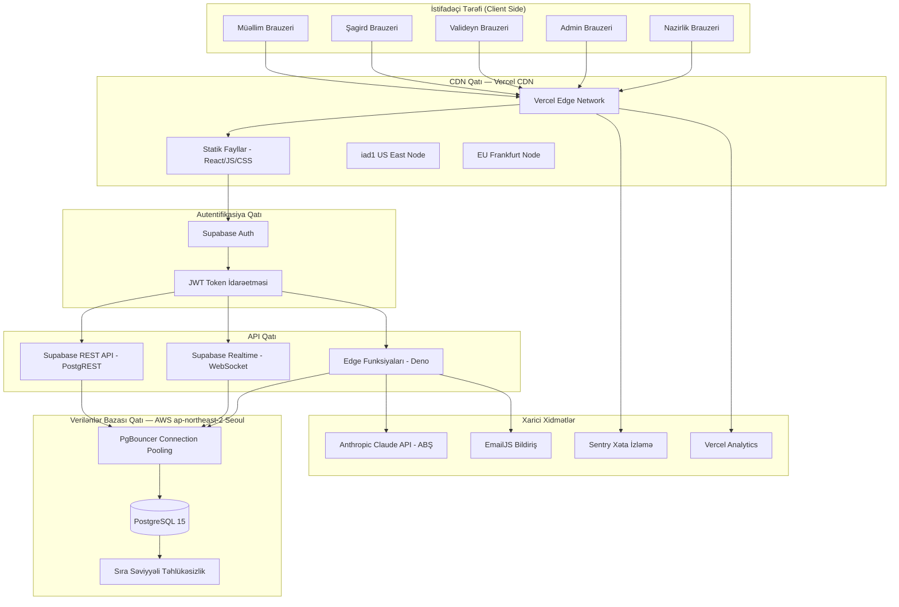
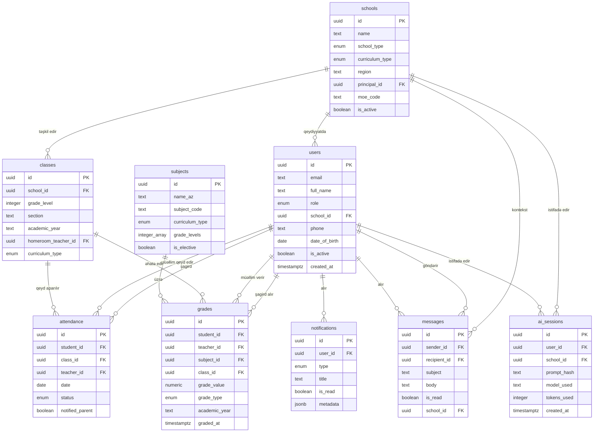
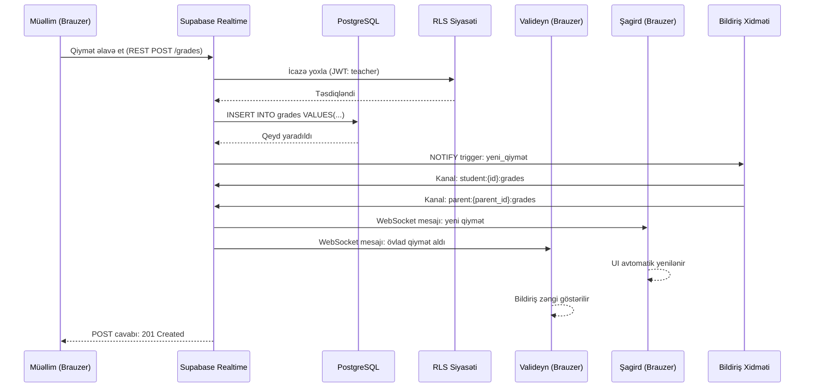
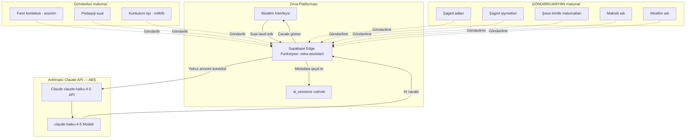
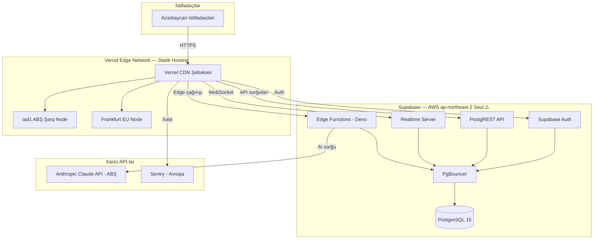

# Texniki Sənədləşdirmə
## Zirva Məktəb İdarəetmə Platforması

**Azərbaycan Respublikası Elm və Təhsil Nazirliyinin № VM26005443 (24.04.2026) tarixli məktubuna cavab olaraq təqdim edilir.**

---

**Sənəd istinadı:** ZRV-MSEA-2026-001  
**Təqdimetmə tarixi:** 28 aprel 2026  
**Hazırlayan:** Kaan Guluzada, Qurucu və Baş İcraçı Direktor, Zirva  
**Əlaqə:** hello@tryzirva.com | +994 50 241 14 42 | +994 90 110 66 00  
**Platforma URL:** https://tryzirva.com

---

## Mündəricat

1. [Sistemə Ümumi Baxış](#1-sistemə-ümumi-baxış)
2. [Arxitektura Təsviri](#2-arxitektura-təsviri)
3. [Texnologiya Yığımı](#3-texnologiya-yığımı)
4. [Verilənlər Bazası Sxemi](#4-verilənlər-bazası-sxemi)
5. [Rol Əsaslı Giriş Nəzarəti](#5-rol-əsaslı-giriş-nəzarəti)
6. [Real Vaxt Məlumat Axını](#6-real-vaxt-məlumat-axını)
7. [Zəka AI Müəllim Köməkçisi](#7-zəka-ai-müəllim-köməkçisi)
8. [İkili Kurikulum Dəstəyi](#8-i̇kili-kurikulum-dəstəyi)
9. [API Səthi](#9-api-səthi)
10. [Yerləşdirmə Topologiyası](#10-yerləşdirmə-topologiyası)
11. [Miqyaslanma](#11-miqyaslanma)
12. [Məlumat Rezidentliyi və Təhlükəsizlik](#12-məlumat-rezidentliyi-və-təhlükəsizlik)
13. [Növbəti Addımlar / Tələb Olunan Qərarlar](#13-növbəti-addımlar--tələb-olunan-qərarlar)

---

## 1. Sistemə Ümumi Baxış

### 1.1 Platforma Haqqında

Zirva, Azərbaycan məktəblərinin rəqəmsal idarəetmə tələblərini qarşılamaq üçün hazırlanmış müasir veb əsaslı məktəb idarəetmə platformasıdır. Platforma, müəllimlər, şagirdlər, valideynlər, məktəb administratorları və Nazirlik nümayəndələri arasında məlumat mübadiləsini, tədris idarəetməsini və analitik hesabatları vahid bir rəqəmsal ekosistem çərçivəsində birləşdirir.

Zirva platforması aşağıdakı əsas funksionallıqları əhatə edir:

- **Qiymətləndirmə İdarəetməsi:** Müəllimlər tərəfindən qiymətlərin daxil edilməsi, şagirdlər tərəfindən izlənilməsi, valideynlər tərəfindən real vaxt rejimində müşahidəsi
- **Davamiyyət Uçotu:** Günlük davamiyyət qeydlərinin aparılması, avtomatik bildirişlər, statistik hesabatlar
- **Mesajlaşma Sistemi:** Rol əsaslı daxili mesajlaşma — müəllim-valideyn, administrator-müəllim, Nazirlik-məktəb kommunikasiyaları
- **Zəka AI Müəllim Köməkçisi:** Süni intellekt texnologiyasına əsaslanan pedaqoji dəstək sistemi
- **Kurikulum İdarəetməsi:** Azərbaycan Milli Kurikulumu və Beynəlxalq Bakalavr (International Baccalaureate) proqramlarının paralel dəstəyi
- **Hesabat və Analitika:** Məktəb, rayon və ümummilli səviyyədə tədris performansı hesabatları
- **İnzibati İdarəetmə:** Məktəb strukturunun, sinif tərkibinin, fənn cədvəlinin idarə edilməsi

### 1.2 Hədəf İstifadəçi Kütləsi

Zirva platformasının hədəf istifadəçi kütləsi Azərbaycan Respublikasının ümumi təhsil sistemi çərçivəsindədir:

| Göstərici | Dəyər |
|---|---|
| Azərbaycandakı ümumi məktəb sayı | ~4,700 |
| Ümumi şagird sayı | ~1,500,000+ |
| Ümumi müəllim sayı | ~170,000+ |
| Hədəf istifadəçi sayı (tam tətbiq) | ~1,800,000 |
| Pilot mərhələ hədəfi | 5–10 məktəb |

### 1.3 İş Prinsipləri

Platforma aşağıdakı texniki prinsiplər üzərində qurulmuşdur:

1. **Məlumat Təhlükəsizliyi:** Bütün şəxsi məlumatlar şifrələnmiş kanallar vasitəsilə ötürülür və şifrəli formada saxlanılır
2. **Rol Əsaslı Giriş (Role-Based Access Control):** Hər istifadəçi yalnız öz rolu çərçivəsindəki məlumatlara giriş hüququna malikdir
3. **Miqyaslanabilirlik (Scalability):** Platform arxitekturası 1.8 milyon istifadəçiyə qədər şaquli və üfüqi miqyaslanmağa imkan verir
4. **Əlçatanlıq:** Mobil cihazlar, planşetlər və masa üstü kompüterlər üçün uyğunlaşdırılmış cavabverici (responsive) interfeys
5. **Açıq Standartlar:** REST API, JWT, OAuth 2.0 kimi sənaye standartlarına uyğunluq

---

## 2. Arxitektura Təsviri

### 2.1 Ümumi Arxitektura

Zirva platforması üçqatlı (three-tier) veb arxitekturası prinsipinə əsaslanır:

- **Təqdimat Qatı (Presentation Layer):** React 18 əsaslı tək səhifəli tətbiq (Single Page Application)
- **Məntiq Qatı (Logic Layer):** Supabase Edge Funksiyaları və Supabase Realtime
- **Məlumat Qatı (Data Layer):** Supabase PostgreSQL verilənlər bazası

### 2.2 Sistem Arxitekturası Diaqramı



### 2.3 Məlumat Axını

İstifadəçinin platformaya daxil olmasından tutmuş məlumat əməliyyatının tamamlanmasına qədər axın aşağıdakı mərhələlərdən keçir:

1. İstifadəçi brauzer vasitəsilə Vercel CDN-dən statik faylları yükləyir
2. React tətbiqi başladılır, Supabase JS klient inisializasiya olunur
3. İstifadəçi e-poçt/şifrə ilə giriş edir, Supabase Auth JWT token qaytarır
4. JWT token hər API sorğusuna Authorization başlığı kimi əlavə edilir
5. PostgREST Sıra Səviyyəli Təhlükəsizlik (Row Level Security — RLS) siyasətlərini tətbiq edir
6. Verilənlər şifrələnmiş formada PostgreSQL-dən qaytarılır
7. Real vaxt hadisələr WebSocket bağlantısı vasitəsilə abunəçilərə çatdırılır

---

## 3. Texnologiya Yığımı

### 3.1 Ön Tərəf (Frontend) Texnologiyaları

| Paket | Versiya | Məqsəd |
|---|---|---|
| React | 18.x | Əsas İstifadəçi İnterfeysi (UI) çərçivəsi |
| Vite | 5.x | Yığım aləti (build tool) və inkişaf serveri |
| JavaScript (ES2022+) | — | Əsas proqramlaşdırma dili |
| React Router | v6.x | Müştəri tərəfli marşrutlaşdırma (client-side routing) |
| Tailwind CSS | v3.x | Utility-əsaslı CSS çərçivəsi |
| Supabase JS | v2.x | Supabase müştəri kitabxanası |
| @vercel/analytics | Ən son | Anonim istifadə analitikası |
| @sentry/react | v8.x | Ön tərəf xəta izləmə |
| EmailJS | Ən son | Müştəri tərəfli e-poçt göndərmə |
| jsPDF | Ən son | Müştəri tərəfli PDF generasiyası |

### 3.2 Arxa Tərəf (Backend) Xidmətləri

| Xidmət | Versiya/Tip | Məqsəd |
|---|---|---|
| Supabase | Pro Plan | Arxa tərəf-xidmət kimi (Backend-as-a-Service) |
| PostgreSQL | 15.x | Əsas əlaqəli verilənlər bazası |
| PostgREST | Daxili | REST API generasiyası |
| Supabase Auth | Daxili | Autentifikasiya xidməti |
| Supabase Realtime | Daxili | WebSocket əsaslı real vaxt bildirişlər |
| Supabase Edge Functions | Deno | Serverless hesablama funksiyaları |
| PgBouncer | Daxili | Bağlantı hovuzu (connection pooling) |

### 3.3 İnfrastruktur

| Komponent | Təminatçı | Region |
|---|---|---|
| Statik Hosting (Ön Tərəf) | Vercel CDN | iad1 ABŞ Şərq + Avropa düyünləri |
| Verilənlər Bazası | Supabase (AWS) | ap-northeast-2 (Seul, Cənubi Koreya) ⚠️ |
| AI API | Anthropic | ABŞ |
| Xəta İzləmə | Sentry | Avropa |

> **⚠️ XƏBƏRDARLIQ:** Verilənlər bazasının Cənubi Koreyada yerləşməsi məlumat rezidentliyi baxımından hüquqi risk yaradır. Bax: Bölmə 12.

### 3.4 İnkişaf Alətləri

| Alət | Məqsəd |
|---|---|
| Git / GitHub | Versiya nəzarəti |
| Vite HMR | Sürətli inkişaf dövrəsi (hot module replacement) |
| Supabase CLI | Yerli inkişaf mühiti və miqrasiya idarəetməsi |
| Vercel CLI | Yerləşdirmə (deployment) avtomatlaşdırması |

---

## 4. Verilənlər Bazası Sxemi

### 4.1 Sxem Prinsipləri

Zirva verilənlər bazası sxemi aşağıdakı prinsiplərə əsaslanır:

- Bütün cədvəllər UUID əsaslı birincil açar (primary key) istifadə edir
- Yaradılma və yenilənmə zaman damğaları (timestamp) bütün cədvəllərdə mövcuddur
- Xarici açar (foreign key) əlaqələri referans bütövlüyünü (referential integrity) təmin edir
- Sıra Səviyyəli Təhlükəsizlik (Row Level Security — RLS) bütün cədvəllərdə aktivdir
- Soft silmə (soft delete) yanaşması: fiziki silmə əvəzinə `deleted_at` zaman damğası istifadə olunur

### 4.2 Əsas Cədvəllər

#### 4.2.1 `users` — İstifadəçilər

| Sütun | Tip | Məhdudiyyət | Təsvir |
|---|---|---|---|
| `id` | UUID | PRIMARY KEY | Supabase Auth ilə sinxronizasiya |
| `email` | TEXT | UNIQUE NOT NULL | İstifadəçi e-poçtu |
| `full_name` | TEXT | NOT NULL | Ad Soyad |
| `role` | ENUM | NOT NULL | müəllim / şagird / valideyn / admin / nazirlik |
| `school_id` | UUID | FK → schools | Bağlı olduğu məktəb |
| `phone` | TEXT | — | Telefon nömrəsi |
| `date_of_birth` | DATE | — | Doğum tarixi (şagirdlər üçün) |
| `gender` | ENUM | — | kişi / qadın |
| `avatar_url` | TEXT | — | Profil şəklinin URL-i |
| `is_active` | BOOLEAN | DEFAULT TRUE | Aktiv/qeyri-aktiv status |
| `last_login_at` | TIMESTAMPTZ | — | Son giriş zaman damğası |
| `created_at` | TIMESTAMPTZ | DEFAULT now() | Yaradılma tarixi |
| `updated_at` | TIMESTAMPTZ | DEFAULT now() | Yenilənmə tarixi |
| `deleted_at` | TIMESTAMPTZ | — | Silinmə tarixi (soft delete) |

#### 4.2.2 `schools` — Məktəblər

| Sütun | Tip | Məhdudiyyət | Təsvir |
|---|---|---|---|
| `id` | UUID | PRIMARY KEY | Məktəb identifikatoru |
| `name` | TEXT | NOT NULL | Məktəbin tam adı |
| `short_name` | TEXT | — | Qısa ad |
| `school_type` | ENUM | NOT NULL | dövlət / özəl / lisey / gimnasiya |
| `curriculum_type` | ENUM | NOT NULL | milli / ib / ikili |
| `region` | TEXT | NOT NULL | Rayon/şəhər |
| `district` | TEXT | — | İnzibati rayon |
| `address` | TEXT | — | Ünvan |
| `phone` | TEXT | — | Məktəb telefonu |
| `email` | TEXT | — | Məktəb e-poçtu |
| `principal_id` | UUID | FK → users | Direktor |
| `moe_code` | TEXT | UNIQUE | Nazirlik tərəfindən verilən məktəb kodu |
| `is_active` | BOOLEAN | DEFAULT TRUE | Aktiv status |
| `created_at` | TIMESTAMPTZ | DEFAULT now() | Yaradılma tarixi |
| `updated_at` | TIMESTAMPTZ | DEFAULT now() | Yenilənmə tarixi |

#### 4.2.3 `classes` — Siniflər

| Sütun | Tip | Məhdudiyyət | Təsvir |
|---|---|---|---|
| `id` | UUID | PRIMARY KEY | Sinif identifikatoru |
| `school_id` | UUID | FK → schools NOT NULL | Bağlı məktəb |
| `grade_level` | INTEGER | NOT NULL, CHECK 1–12 | Sinif səviyyəsi (1–12) |
| `section` | TEXT | NOT NULL | Bölmə (A, B, C...) |
| `academic_year` | TEXT | NOT NULL | Tədris ili (məs. 2025-2026) |
| `homeroom_teacher_id` | UUID | FK → users | Sinif rəhbəri |
| `curriculum_type` | ENUM | NOT NULL | milli / ib |
| `student_count` | INTEGER | DEFAULT 0 | Şagird sayı (hesablanan) |
| `created_at` | TIMESTAMPTZ | DEFAULT now() | Yaradılma tarixi |
| `updated_at` | TIMESTAMPTZ | DEFAULT now() | Yenilənmə tarixi |

#### 4.2.4 `subjects` — Fənlər

| Sütun | Tip | Məhdudiyyət | Təsvir |
|---|---|---|---|
| `id` | UUID | PRIMARY KEY | Fənn identifikatoru |
| `name_az` | TEXT | NOT NULL | Azərbaycan dilində fənn adı |
| `name_en` | TEXT | — | İngilis dilində fənn adı |
| `subject_code` | TEXT | UNIQUE | Fənn kodu |
| `curriculum_type` | ENUM | NOT NULL | milli / ib / hər ikisi |
| `grade_levels` | INTEGER[] | NOT NULL | Tətbiq edildiyi sinif səviyyələri |
| `weekly_hours` | INTEGER | — | Həftəlik saat sayı |
| `is_elective` | BOOLEAN | DEFAULT FALSE | Seçmə fənn statusu |
| `created_at` | TIMESTAMPTZ | DEFAULT now() | Yaradılma tarixi |

#### 4.2.5 `grades` — Qiymətlər

| Sütun | Tip | Məhdudiyyət | Təsvir |
|---|---|---|---|
| `id` | UUID | PRIMARY KEY | Qiymət identifikatoru |
| `student_id` | UUID | FK → users NOT NULL | Şagird |
| `teacher_id` | UUID | FK → users NOT NULL | Qiymət verən müəllim |
| `subject_id` | UUID | FK → subjects NOT NULL | Fənn |
| `class_id` | UUID | FK → classes NOT NULL | Sinif |
| `grade_value` | NUMERIC(4,2) | NOT NULL, CHECK 1–100 | Qiymət dəyəri |
| `grade_type` | ENUM | NOT NULL | cari / aralıq / yekun / olimpiada |
| `academic_term` | TEXT | NOT NULL | Tədris semestri |
| `academic_year` | TEXT | NOT NULL | Tədris ili |
| `comment` | TEXT | — | Müəllim şərhi |
| `graded_at` | TIMESTAMPTZ | NOT NULL | Qiymət verilmə tarixi |
| `created_at` | TIMESTAMPTZ | DEFAULT now() | Yaradılma tarixi |
| `updated_at` | TIMESTAMPTZ | DEFAULT now() | Yenilənmə tarixi |

#### 4.2.6 `attendance` — Davamiyyət

| Sütun | Tip | Məhdudiyyət | Təsvir |
|---|---|---|---|
| `id` | UUID | PRIMARY KEY | Qeyd identifikatoru |
| `student_id` | UUID | FK → users NOT NULL | Şagird |
| `class_id` | UUID | FK → classes NOT NULL | Sinif |
| `subject_id` | UUID | FK → subjects | Fənn (ixtiyari) |
| `teacher_id` | UUID | FK → users NOT NULL | Müəllim |
| `date` | DATE | NOT NULL | Tarix |
| `status` | ENUM | NOT NULL | iştirak etdi / qayıb / gecikdi / üzrlü |
| `reason` | TEXT | — | Qayıb səbəbi |
| `notified_parent` | BOOLEAN | DEFAULT FALSE | Valideyn bildiriş statusu |
| `created_at` | TIMESTAMPTZ | DEFAULT now() | Yaradılma tarixi |

#### 4.2.7 `messages` — Mesajlar

| Sütun | Tip | Məhdudiyyət | Təsvir |
|---|---|---|---|
| `id` | UUID | PRIMARY KEY | Mesaj identifikatoru |
| `sender_id` | UUID | FK → users NOT NULL | Göndərən |
| `recipient_id` | UUID | FK → users NOT NULL | Alan |
| `subject` | TEXT | NOT NULL | Mövzu |
| `body` | TEXT | NOT NULL | Mətn |
| `is_read` | BOOLEAN | DEFAULT FALSE | Oxunma statusu |
| `read_at` | TIMESTAMPTZ | — | Oxunma tarixi |
| `parent_message_id` | UUID | FK → messages | Cavab verilən mesaj |
| `school_id` | UUID | FK → schools NOT NULL | Məktəb konteksti |
| `created_at` | TIMESTAMPTZ | DEFAULT now() | Göndərilmə tarixi |
| `deleted_at` | TIMESTAMPTZ | — | Silinmə tarixi |

#### 4.2.8 `notifications` — Bildirişlər

| Sütun | Tip | Məhdudiyyət | Təsvir |
|---|---|---|---|
| `id` | UUID | PRIMARY KEY | Bildiriş identifikatoru |
| `user_id` | UUID | FK → users NOT NULL | Alıcı istifadəçi |
| `type` | ENUM | NOT NULL | qiymət / davamiyyət / mesaj / sistem / ai |
| `title` | TEXT | NOT NULL | Bildiriş başlığı |
| `body` | TEXT | NOT NULL | Bildiriş mətni |
| `is_read` | BOOLEAN | DEFAULT FALSE | Oxunma statusu |
| `action_url` | TEXT | — | İstiqamətlənəcək URL |
| `metadata` | JSONB | — | Əlavə strukturlu məlumat |
| `created_at` | TIMESTAMPTZ | DEFAULT now() | Yaradılma tarixi |
| `expires_at` | TIMESTAMPTZ | — | Bitmə tarixi |

#### 4.2.9 `ai_sessions` — AI Sessiyaları

| Sütun | Tip | Məhdudiyyət | Təsvir |
|---|---|---|---|
| `id` | UUID | PRIMARY KEY | Sessiya identifikatoru |
| `user_id` | UUID | FK → users NOT NULL | İstifadəçi (müəllim) |
| `school_id` | UUID | FK → schools NOT NULL | Məktəb |
| `prompt_hash` | TEXT | NOT NULL | Sorğunun SHA-256 xülasəsi (anonimləşdirilmiş) |
| `response_length` | INTEGER | — | Cavabın simvol uzunluğu |
| `model_used` | TEXT | NOT NULL | İstifadə edilən AI modeli |
| `tokens_used` | INTEGER | — | İstifadə edilən token sayı |
| `subject_context` | TEXT | — | Fənn konteksti (şəxsi məlumat yox) |
| `duration_ms` | INTEGER | — | Cavab müddəti (millisaniyə) |
| `created_at` | TIMESTAMPTZ | DEFAULT now() | Sessiya tarixi |

> **Qeyd:** `ai_sessions` cədvəlində şagird adları, qiymətlər və ya digər şəxsi məlumatlar saxlanılmır. Yalnız anonim metadata qeyd edilir.

### 4.3 Verilənlər Bazası ER Diaqramı



### 4.4 İndekslər və Performans

Sorğu performansını artırmaq üçün aşağıdakı indekslər tətbiq edilmişdir:

```sql
-- Qiymətlər: tez-tez istifadə edilən sorğular üçün
CREATE INDEX idx_grades_student_year ON grades(student_id, academic_year);
CREATE INDEX idx_grades_class_subject ON grades(class_id, subject_id);

-- Davamiyyət: tarix əsaslı sorğular üçün
CREATE INDEX idx_attendance_student_date ON attendance(student_id, date DESC);
CREATE INDEX idx_attendance_class_date ON attendance(class_id, date DESC);

-- Mesajlar: oxunmamış mesajlar üçün
CREATE INDEX idx_messages_recipient_unread ON messages(recipient_id) WHERE is_read = FALSE;

-- AI sessiyaları: istifadəçi tarixçəsi üçün
CREATE INDEX idx_ai_sessions_user_created ON ai_sessions(user_id, created_at DESC);
```

---

## 5. Rol Əsaslı Giriş Nəzarəti

### 5.1 Rol Tərifləri

Zirva platformasında beş əsas istifadəçi rolu mövcuddur:

| Rol | Azərbaycan adı | Əhatə |
|---|---|---|
| `teacher` | Müəllim | Öz sinif və fənlərini idarə edir |
| `student` | Şagird | Öz məlumatlarını oxuya bilir |
| `parent` | Valideyn | Övladının məlumatlarını izləyir |
| `school_admin` | Məktəb Administratoru | Öz məktəbini tam idarə edir |
| `ministry` | Nazirlik | Bütün məktəblərə oxuma girişi var |

### 5.2 İcazə Matrisi

| Əməliyyat | Müəllim | Şagird | Valideyn | Məktəb Admini | Nazirlik |
|---|---|---|---|---|---|
| Öz profilini oxu | ✓ | ✓ | ✓ | ✓ | ✓ |
| Öz profilini yenilə | ✓ | ✓ | ✓ | ✓ | ✓ |
| Qiymət əlavə et | ✓ (öz fəni) | ✗ | ✗ | ✓ | ✗ |
| Qiymət oxu | ✓ (öz fəni) | ✓ (öz) | ✓ (övlad) | ✓ (məktəb) | ✓ (hamı) |
| Qiymət yenilə | ✓ (öz, 48s) | ✗ | ✗ | ✓ | ✗ |
| Qiymət sil | ✗ | ✗ | ✗ | ✓ | ✗ |
| Davamiyyət qeyd et | ✓ (öz sinfi) | ✗ | ✗ | ✓ | ✗ |
| Davamiyyət oxu | ✓ (öz sinfi) | ✓ (öz) | ✓ (övlad) | ✓ (məktəb) | ✓ (hamı) |
| Mesaj göndər | ✓ | ✓ (müəllimlərə) | ✓ (müəllimlərə) | ✓ | ✓ |
| Sinif yarat | ✗ | ✗ | ✗ | ✓ | ✗ |
| Sinif oxu | ✓ (öz) | ✓ (öz) | ✓ (övlad) | ✓ (məktəb) | ✓ (hamı) |
| Məktəb yarat | ✗ | ✗ | ✗ | ✗ | ✓ |
| Məktəb yenilə | ✗ | ✗ | ✗ | ✓ (öz) | ✓ |
| İstifadəçi yarat | ✗ | ✗ | ✗ | ✓ (məktəb) | ✓ |
| AI köməkçisi | ✓ | ✗ | ✗ | ✓ | ✓ |
| Hesabat ixrac et | ✗ | ✓ (öz) | ✓ (övlad) | ✓ (məktəb) | ✓ (hamı) |
| Sistem konfiqurasiyası | ✗ | ✗ | ✗ | ✓ (məktəb) | ✓ |

### 5.3 Sıra Səviyyəli Təhlükəsizlik (Row Level Security — RLS)

Supabase PostgreSQL-in Sıra Səviyyəli Təhlükəsizlik (Row Level Security — RLS) funksionallığı vasitəsilə hər cədvəl üçün rol əsaslı giriş siyasətləri tətbiq edilir. Bu o deməkdir ki, verilənlər bazası özü hər sorğunu filtirləyir — tətbiq qatında icazə yoxlanışından asılılıq minimuma endirilir.

**Nümunə: `grades` cədvəli üçün RLS siyasətləri**

```sql
-- Şagird yalnız öz qiymətlərini görə bilər
CREATE POLICY "student_own_grades" ON grades
  FOR SELECT USING (
    student_id = auth.uid()
    AND auth.jwt() ->> 'role' = 'student'
  );

-- Müəllim yalnız öz tədris etdiyi fənlər üzrə qiymətlərə giriş edə bilər
CREATE POLICY "teacher_own_subject_grades" ON grades
  FOR ALL USING (
    teacher_id = auth.uid()
    AND auth.jwt() ->> 'role' = 'teacher'
  );

-- Valideyn yalnız övladının qiymətlərini görə bilər
CREATE POLICY "parent_child_grades" ON grades
  FOR SELECT USING (
    student_id IN (
      SELECT child_id FROM parent_child_links
      WHERE parent_id = auth.uid()
    )
    AND auth.jwt() ->> 'role' = 'parent'
  );

-- Məktəb administratoru öz məktəbinin bütün qiymətlərini görə bilər
CREATE POLICY "admin_school_grades" ON grades
  FOR ALL USING (
    class_id IN (
      SELECT id FROM classes
      WHERE school_id = (
        SELECT school_id FROM users WHERE id = auth.uid()
      )
    )
    AND auth.jwt() ->> 'role' = 'school_admin'
  );

-- Nazirlik bütün qiymətlərə oxuma girişi var
CREATE POLICY "ministry_read_all_grades" ON grades
  FOR SELECT USING (
    auth.jwt() ->> 'role' = 'ministry'
  );
```

### 5.4 JWT Rol Tələbləri

Hər JWT tokeninə aşağıdakı fərdi tələblər (custom claims) daxil edilir:

```json
{
  "sub": "uuid-of-user",
  "email": "user@example.com",
  "role": "teacher",
  "school_id": "uuid-of-school",
  "iat": 1714262400,
  "exp": 1714348800
}
```

---

## 6. Real Vaxt Məlumat Axını

### 6.1 Real Vaxt Arxitekturası

Zirva platforması Supabase Realtime xidmətindən istifadə edərək WebSocket (RFC 6455) protokolu vasitəsilə real vaxt məlumat axınını təmin edir. Bu, istifadəçilərin səhifəni yeniləmədən dərhal bildiriş almasına imkan verir.

Real vaxt funksionallıqları:

- **Qiymət bildirişləri:** Müəllim qiymət daxil etdikdə şagird və valideyn dərhal bildiriş alır
- **Davamiyyət xəbərdarlıqları:** Qayıb qeyd edildikdə valideynə avtomatik bildiriş göndərilir
- **Mesaj bildirişləri:** Yeni mesaj gəldikdə alıcı real vaxt notifikasiya alır
- **Canlı davamiyyət lövhəsi:** Məktəb administratorları günlük davamiyyəti real vaxt izləyir

### 6.2 Real Vaxt Məlumat Axını Sıra Diaqramı



### 6.3 WebSocket Abunəlik Nümunəsi

```javascript
// Şagird öz yeni qiymətlərinə abunə olur
const channel = supabase
  .channel(`student-grades-${userId}`)
  .on(
    'postgres_changes',
    {
      event: 'INSERT',
      schema: 'public',
      table: 'grades',
      filter: `student_id=eq.${userId}`
    },
    (payload) => {
      // Yeni qiymət bildirişi göstər
      showNotification(`Yeni qiymət: ${payload.new.grade_value}`);
      // Qiymət siyahısını yenilə
      refetchGrades();
    }
  )
  .subscribe();
```

---

## 7. Zəka AI Müəllim Köməkçisi

### 7.1 Ümumi Baxış

Zəka, Zirva platformasının süni intellekt (artificial intelligence — AI) əsaslı müəllim köməkçisidir. Zəka, Anthropic şirkətinin Claude claude-haiku-4-5 modelindən istifadə edərək müəllimlərə pedaqoji dəstək, fənn izahları, dərs planı tövsiyələri və qiymətləndirmə köməyi təqdim edir.

### 7.2 Zəka Arxitekturası



### 7.3 Anthropic API-yə Göndərilən Məlumat

**GÖNDƏRİLƏN:**
- Müəllimin ümumi pedaqoji sualı (məs. "5-ci sinif riyaziyyat mövzusu üçün izah üsulu nədir?")
- Fənn konteksti — adlı deyil, kateqoriya şəklində (məs. "riyaziyyat", "Azərbaycan dili")
- Kurikulum tipi (milli / IB)
- Sinif səviyyəsi (nömrəvi: məs. "5")
- Platforma sistem promptu (sabit Azərbaycan məktəb konteksti)

**GÖNDƏRİLMƏYƏN:**
- Şagird adları, soyadları, şəxsiyyət nömrələri
- Fərdi şagird qiymətləri və ya performans məlumatları
- Müəllim adı, soyadı, e-poçtu
- Məktəbin adı, ünvanı, kodu
- Valideyn məlumatları
- Hər hansı şəxsən müəyyən edilə bilən məlumat (Personally Identifiable Information — PII)

### 7.4 Məlumat Saxlama Siyasəti

Zirva sistemi Anthropic Claude API-yə göndərilən sorğuları öz `ai_sessions` cədvəlində yalnız anonim metadata şəklində saxlayır:

- SHA-256 xülasəsi (prompt mətninin özü deyil)
- İstifadə edilən model adı
- Token sayı (məlumat miqyası üçün)
- Millisaniyə cinsindən cavab müddəti
- Fənn kateqoriyası (anonim)

AI sessiya qeydləri **30 gün** sonra avtomatik silinir.

Anthropic öz API şərtlərinə əsasən API sorğu məlumatlarını model məşqi üçün istifadə etmir (Business plan şərtləri).

### 7.5 Texniki Tətbiq

Zəka köməkçisi Supabase Edge Funksiyası kimi tətbiq edilmişdir:

```javascript
// supabase/functions/zeka-assistant/index.ts (sadələşdirilmiş)
import Anthropic from '@anthropic-ai/sdk';

const client = new Anthropic({
  apiKey: Deno.env.get('ANTHROPIC_API_KEY')
});

// Sistem promptu — yalnız anonim pedaqoji kontekst
const SYSTEM_PROMPT = `
Sən Azərbaycan məktəbi üçün pedaqoji köməkçisən.
Müəllimlərə fənn izahları, dərs planlaması və qiymətləndirmə strategiyaları üzrə kömək edirsən.
Şagird adları, qiymətlər və şəxsi məlumatlar sənə göndərilmir.
Bütün cavabları Azərbaycan dilində ver.
`;

Deno.serve(async (req) => {
  const { question, subject, grade_level, curriculum_type } = await req.json();

  // PII filtirləmə: şəxsi məlumat göndərilmədiyini doğrula
  const safeContext = sanitizeInput({ subject, grade_level, curriculum_type });

  const response = await client.messages.create({
    model: 'claude-haiku-4-5',
    max_tokens: 1024,
    system: SYSTEM_PROMPT,
    messages: [{ role: 'user', content: `${safeContext}\n\nSual: ${question}` }]
  });

  // Yalnız anonim metadata qeyd et
  await logSession({ userId, schoolId, modelUsed: 'claude-haiku-4-5', tokensUsed: response.usage.total_tokens });

  return new Response(JSON.stringify({ answer: response.content[0].text }));
});
```

---

## 8. İkili Kurikulum Dəstəyi

### 8.1 Kurikulum Arxitekturası

Zirva platforması eyni verilənlər bazası sxemi üzərindən həm Azərbaycan Milli Kurikulumunu, həm də Beynəlxalq Bakalavr (International Baccalaureate — IB) proqramını dəstəkləyir. Bu, Azərbaycanda fəaliyyət göstərən beynəlxalq məktəblərin platforma daxilindən xidmət almalarını mümkün edir.

Kurikulum tipi əsas cədvəllərdə `curriculum_type` sütunu vasitəsilə idarə olunur:

```sql
CREATE TYPE curriculum_type AS ENUM ('milli', 'ib', 'ikili');
```

- `milli` — Azərbaycan Milli Kurikulumu
- `ib` — Beynəlxalq Bakalavr
- `ikili` — hər ikisini tədris edən məktəblər (nadir, lakin dəstəklənir)

### 8.2 Kurikulum Müqayisə Cədvəli

| Xüsusiyyət | Azərbaycan Milli Kurikulumu | Beynəlxalq Bakalavr (IB) |
|---|---|---|
| Qiymətləndirmə miqyası | 1–100 bal | IB standart (1–7 bal) |
| Fənn strukturu | TQDK fənnləri | IB fənn qrupları |
| Tədris ili | Sentyabr – İyun | Sentyabr – May |
| Qiymət növləri | Cari, Aralıq, Yekun | Formativ, Summativ, EE |
| Diplom | Azərbaycan dövlət atestatı | IB Diploması |
| Dil tədris dili | Azərbaycan dili əsas | Çoxdilli |
| Tənzimləyici orqan | Azərbaycan Elm və Təhsil Nazirliyi | IB Organization (Geneva) |
| Zirva dəstəyi | Tam | Tam |

### 8.3 Kurikulum Xüsusi Məntiqi

Platforma kurikulum tipinə görə interfeys elementlərini uyğunlaşdırır:

- **Fənn siyahısı:** `curriculum_type` filtrəsinə görə göstərilir
- **Qiymət forması:** Milli üçün 1–100, IB üçün 1–7 miqyası tətbiq edilir
- **Hesabat şablonları:** Kurikulum standartlarına uyğun ayrı şablon
- **Dil:** Milli üçün Azərbaycan dili interfeysi; IB üçün ikidilli (Azərbaycan + İngilis) seçim

---

## 9. API Səthi

### 9.1 REST API

Zirva platforması Supabase tərəfindən avtomatik yaradılan PostgREST REST API-sindən istifadə edir. Bütün REST sorğuları `https://[DOLDURUN: supabase-proje-id].supabase.co/rest/v1/` ünvanı ilə başlayır.

**Autentifikasiya başlıqları:**
```
apikey: <anon-public-key>
Authorization: Bearer <jwt-token>
Content-Type: application/json
```

**Əsas endpointlər:**

| Endpoint | Metod | Təsvir |
|---|---|---|
| `/rest/v1/grades` | GET | Qiymətləri siyahıla (RLS filtrəsi ilə) |
| `/rest/v1/grades` | POST | Yeni qiymət əlavə et |
| `/rest/v1/grades?id=eq.{id}` | PATCH | Qiymət yenilə |
| `/rest/v1/attendance` | GET | Davamiyyət qeydlərini siyahıla |
| `/rest/v1/attendance` | POST | Davamiyyət qeyd et |
| `/rest/v1/messages` | GET | Mesajları siyahıla |
| `/rest/v1/messages` | POST | Yeni mesaj göndər |
| `/rest/v1/notifications` | GET | Bildirişləri siyahıla |
| `/rest/v1/schools` | GET | Məktəbləri siyahıla |
| `/rest/v1/users` | GET | İstifadəçiləri siyahıla |

### 9.2 Real Vaxt API

WebSocket əsaslı abunəlik `wss://[DOLDURUN: supabase-proje-id].supabase.co/realtime/v1` ünvanı vasitəsilə həyata keçirilir.

### 9.3 Edge Funksiyaları

| Funksiya | Endpoint | Təsvir |
|---|---|---|
| `zeka-assistant` | `/functions/v1/zeka-assistant` | AI müəllim köməkçisi |
| `send-notification` | `/functions/v1/send-notification` | E-poçt bildirişi göndər |
| `generate-report` | `/functions/v1/generate-report` | PDF hesabat generasiyası |
| `import-students` | `/functions/v1/import-students` | Toplu şagird yükləmə |

### 9.4 Autentifikasiya Endpointləri

| Endpoint | Metod | Təsvir |
|---|---|---|
| `/auth/v1/signup` | POST | Yeni istifadəçi qeydiyyatı |
| `/auth/v1/token?grant_type=password` | POST | E-poçt/şifrə ilə giriş |
| `/auth/v1/token?grant_type=refresh_token` | POST | Token yeniləmə |
| `/auth/v1/logout` | POST | Çıxış |
| `/auth/v1/user` | GET | Cari istifadəçi məlumatı |

---

## 10. Yerləşdirmə Topologiyası

### 10.1 İnfrastruktur Komponentləri

**Vercel CDN (Ön Tərəf Hosting):**
- Bütün statik fayllar (HTML, JavaScript, CSS, şəkillər) Vercel CDN şəbəkəsindən xidmət edir
- Şəxsi məlumat Vercel infrastrukturunda saxlanılmır
- Əsas node: iad1 (ABŞ Şərq); Avropa node: Frankfurt
- Avtomatik TLS sertifikatı (Let's Encrypt)
- HTTP/2 və HSTS aktivdir

**Supabase (Arxa Tərəf):**
- AWS ap-northeast-2 (Seul, Cənubi Koreya) regionunda yerləşir — ⚠️ məlumat rezidentliyi riski
- PostgreSQL 15 verilənlər bazası
- PgBouncer connection pooler (bağlantı hovuzu)
- Realtime WebSocket serveri
- Edge Functions (Deno runtime)
- Supabase Auth xidməti

### 10.2 Yerləşdirmə Topologiyası Diaqramı



### 10.3 Yerləşdirmə Prosesi

```
Git push → GitHub → Vercel CI/CD → 
  Build (Vite) → Test → Deploy to CDN
  
Supabase miqrasiyaları:
  supabase db push → PostgreSQL migration
  supabase functions deploy → Edge Functions
```

---

## 11. Miqyaslanma

### 11.1 Miqyaslama Hədəfləri

Azərbaycan təhsil sisteminə tam tətbiq zamanı platforma aşağıdakı yükə tab gətirməlidir:

| Göstərici | Hədəf |
|---|---|
| Ümumi qeydiyyatlı istifadəçi | 1,800,000 |
| Eyni vaxtda aktiv istifadəçi (pik) | 150,000 |
| Eyni vaxtda WebSocket bağlantısı | 50,000 |
| Gündəlik API sorğusu | 10,000,000+ |
| Verilənlər bazası ölçüsü (5 il) | ~5 TB |

### 11.2 Bağlantı Hovuzu (Connection Pooling)

PostgreSQL birbaşa bağlantıları məhduddur. PgBouncer transaction-mode connection pooler aşağıdakı konfiqurasiya ilə tətbiq edilir:

- **Rejim:** Transaction pooling (əməliyyat hovuzu)
- **Maksimum hovuz ölçüsü:** [DOLDURUN: PgBouncer konfiqurasiyası]
- **Faydası:** 150,000 eyni vaxtda istifadəçini 100–300 actual PostgreSQL bağlantısına endirir

### 11.3 CDN Miqyaslanması

Vercel CDN-in statik fayl xidməti sonsuz miqyaslanma imkanı verir. React tətbiqinin bütün faylları (JS, CSS, HTML) CDN edge node-larında keşlənir. Azərbaycan istifadəçiləri üçün ən yaxın node Frankfurt (EU) node-udur.

### 11.4 Verilənlər Bazası Miqyaslanması

- **Oxuma replikası (Read Replica):** Analitika sorğuları üçün ayrı oxuma replika instance
- **Partisyonlaşdırma:** `grades` və `attendance` cədvəlləri `academic_year` sütununa görə partisyonlaşdırıla bilər
- **Arxivləşdirmə:** 3 ildən köhnə qiymət məlumatları arxiv cədvəllərinə köçürülə bilər

### 11.5 AI Miqyaslanması

Zəka AI köməkçisi asinxron (asynchronous) arxitektura ilə qurulmuşdur. Yüksək trafik dövrlərindəki sorğular növbəyə alınır. claude-haiku-4-5 modeli yüksək sürət/aşağı gecikməyə görə seçilmişdir.

---

## 12. Məlumat Rezidentliyi və Təhlükəsizlik

### 12.1 Cari Vəziyyət

> **⚠️ MÜHİM QEYD — MƏLUMAT REZİDENTLİYİ PROBLEMİ**
>
> Hal-hazırda Zirva platformasının verilənlər bazası Supabase tərəfindən Amazon Web Services (AWS) **ap-northeast-2** regionunda, yəni **Seul, Cənubi Koreya**da yerləşdirilmişdir.
>
> Bu vəziyyət Azərbaycan Respublikasının "Şəxsi məlumatlar haqqında" Qanunu (18.03.1998, №461-IQ) çərçivəsindən xaric ola bilər. Şirkət bu riskdən tam xəbərdardır və aşağıda göstərilən miqrasiya planı hazırlanmışdır.

### 12.2 Miqrasiya Planı

| Mərhələ | Hədəf | Tarix |
|---|---|---|
| Mərhələ 1 | EU-West regionuna miqrasiya (İrlandiya/Frankfurt) | 30 iyun 2026 |
| Mərhələ 2 | Məlumat minimal prinsipinin tətbiqi, PII şifrələmənin gücləndirilməsi | 30 sentyabr 2026 |
| Mərhələ 3 | Azərbaycan yerli hosting — Nazirliyin rəhbərliyi ilə | Q4 2026 |
| Mərhələ 4 | Nazirlik serverindən idarəetmə (ixtiyari) | [DOLDURUN: Nazirlik qərarına əsasən] |

### 12.3 Nəqliyyat Şifrələməsi

- Bütün HTTP trafiki TLS 1.2/1.3 ilə şifrələnir
- HSTS (HTTP Strict Transport Security) aktivdir
- Sertifikat: Let's Encrypt (Vercel tərəfindən avtomatik idarə olunur)

### 12.4 Dayanıqlı Şifrələmə (Encryption at Rest)

- PostgreSQL məlumatları AWS KMS ilə AES-256 şifrələməsi ilə qorunur
- Supabase storage obyektləri AES-256 ilə şifrələnir
- Şifrə hashları bcrypt (cost factor 12) ilə saxlanılır

### 12.5 Sıra Səviyyəli Təhlükəsizlik

Bax: Bölmə 5 — Rol Əsaslı Giriş Nəzarəti.

---

## 13. Növbəti Addımlar / Tələb Olunan Qərarlar

Azərbaycan Respublikası Elm və Təhsil Nazirliyindən aşağıdakı məsələlər üzrə rəhbərlik və qərar xahiş olunur:

| № | Məsələ | Qərar Tələb Olunur |
|---|---|---|
| 1 | **Məlumat rezidentliyi:** Supabase miqrasiyasının EU-West (Mərhələ 1) hədəf tarixinin Nazirlik tərəfindən təsdiqlənməsi | ✓ Qərar tələb olunur |
| 2 | **Azərbaycanda yerli hosting:** Nazirliyin serverinin texniki tələbləri, SLA standartları və zaman çizelgesi | ✓ Qərar tələb olunur |
| 3 | **Pilot məktəb seçimi:** Nazirliyin pilot proqrama daxil ediləcək 5–10 məktəbi müəyyənləşdirməsi | ✓ Qərar tələb olunur |
| 4 | **Nazirlik inteqrasiyası:** Mövcud Nazirlik məlumat sistemləri (e-təhsil, EMIS) ilə texniki inteqrasiya tələbləri | ✓ Qərar tələb olunur |
| 5 | **MOE kodu standartı:** Məktəb identifikasiya kodu formatının Nazirlik standartlarına uyğunlaşdırılması | Məlumat tələb olunur |
| 6 | **Nazirlik rolu girişi:** Nazirlik istifadəçiləri üçün tələb olunan analitika dashboardu və hesabat formatları | Tələblər gözlənilir |
| 7 | **Kurikulum məlumatları:** Milli kurikulum fənn strukturu, saat bölgüsü, qiymətləndirmə kriteriyaları üzrə rəsmi məlumat | Məlumat tələb olunur |

---

*Bu sənəd Zirva şirkəti tərəfindən Azərbaycan Respublikası Elm və Təhsil Nazirliyinin № VM26005443 (24.04.2026) tarixli müraciətinə cavab olaraq hazırlanmışdır.*

*Sənəd istinadı: ZRV-MSEA-2026-001 | Tarix: 28 aprel 2026*

*Kaan Guluzada*  
*Qurucu və Baş İcraçı Direktor, Zirva*  
*hello@tryzirva.com | +994 50 241 14 42 | +994 90 110 66 00*  
*https://tryzirva.com*
