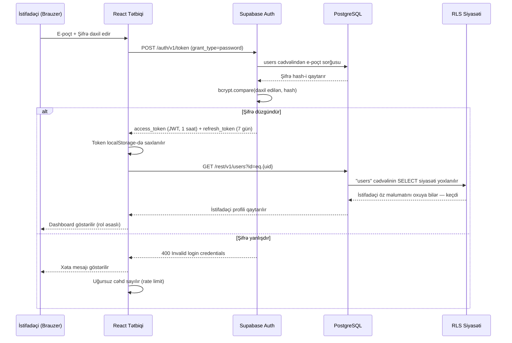
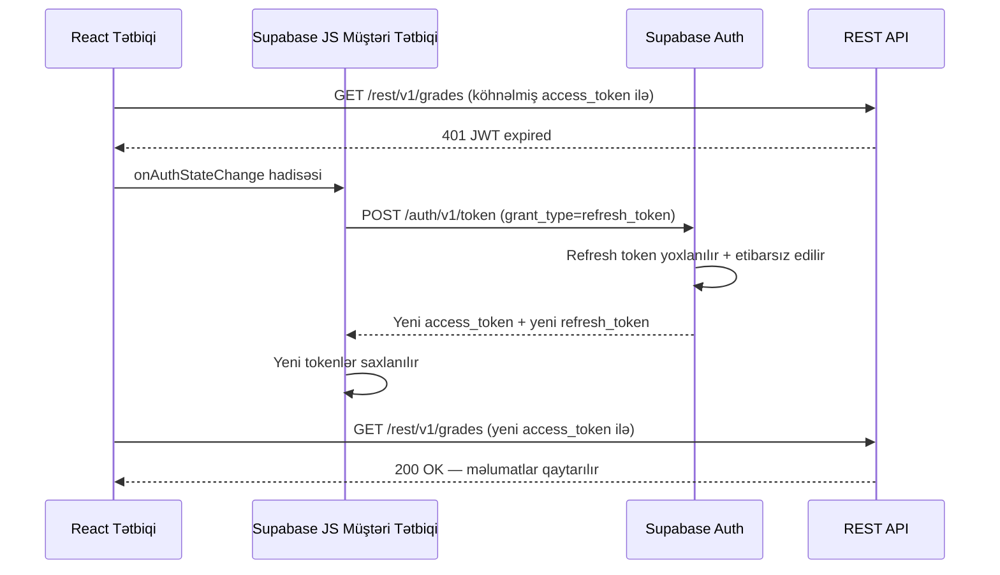

# Təhlükəsizlik Arxitekturası
## Zirva Məktəb İdarəetmə Platforması

**Azərbaycan Respublikası Elm və Təhsil Nazirliyinin № VM26005443 (24.04.2026) tarixli məktubuna cavab olaraq təqdim olunur.**

---

**Sənəd istinadı:** ZRV-MSEA-2026-002  
**Təqdimetmə tarixi:** 28 aprel 2026  
**Hazırlayan:** Kaan Guluzada, Qurucu və Baş İcraçı Direktor, Zirva  
**Əlaqə:** hello@tryzirva.com | +994 50 241 14 42 | +994 90 110 66 00  
**Platformanın URL-i:** https://tryzirva.com

---

## Mündəricat

1. [İcraiyyə Xülasəsi](#1-i̇craiyyə-xülasəsi)
2. [Autentifikasiya](#2-autentifikasiya)
3. [Çox Faktorlu Autentifikasiya](#3-çox-faktorlu-autentifikasiya)
4. [Avtorizasiya və RBAC](#4-avtorizasiya-və-rbac)
5. [Sessiya İdarəetməsi](#5-sessiya-i̇darəetməsi)
6. [API Təhlükəsizliyi](#6-api-təhlükəsizliyi)
7. [İnfrastruktur Təhlükəsizliyi](#7-i̇nfrastruktur-təhlükəsizliyi)
8. [Nəqliyyat Şifrələməsi](#8-nəqliyyat-şifrələməsi)
9. [Dayanıqlı Şifrələmə](#9-dayanıqlı-şifrələmə)
10. [Sirr İdarəetməsi](#10-sirr-i̇darəetməsi)
11. [Audit Jurnalı](#11-audit-jurnalı)
12. [Təhdid Modeli](#12-təhdid-modeli)
13. [Hadisəyə Müdaxilə Planı](#13-hadisəyə-müdaxilə-planı)
14. [Təhlükəsizlik Testi](#14-təhlükəsizlik-testi)
15. [Autentifikasiya Axını Diaqramı](#15-autentifikasiya-axını-diaqramı)
16. [Növbəti Addımlar / Tələb Olunan Qərarlar](#16-növbəti-addımlar--tələb-olunan-qərarlar)

---

## 1. İcraiyyə Xülasəsi

Bu sənəd Zirva Məktəb İdarəetmə Platformasının təhlükəsizlik arxitekturasını ətraflı izah edir. Sənəd Azərbaycan Respublikası Elm və Təhsil Nazirliyinin № VM26005443 (24.04.2026) tarixli müraciətinə cavab olaraq, şəffaflıq prinsipi əsasında hazırlanmışdır.

**Əsas təhlükəsizlik tədbirləri:**

- **Autentifikasiya:** Sənaye standartı Supabase Auth xidməti, JWT əsaslı sessiya idarəetməsi
- **Avtorizasiya:** Sıra səviyyəli təhlükəsizlik (Row Level Security, RLS) ilə gücləndirilmiş rol əsaslı giriş nəzarəti (Role-Based Access Control, RBAC)
- **Şifrələmə:** Nəqliyyatda TLS 1.3, dayanıqlı məlumatlarda AES-256, şifrələrdə bcrypt (cost 12)
- **İnfrastruktur:** Vercel SOC 2 Type II, Supabase SOC 2 Type II sertifikatları
- **Monitorinq:** Sentry xəta izləmə, audit qeydləri, real vaxt anomaliya aşkarlanması

**Dürüstlük qeydi:** Çox faktorlu autentifikasiya (Multi-Factor Authentication, MFA) texniki olaraq planlaşdırılmış, lakin hazırda tətbiq edilməmişdir; pilot mərhələsinin ilk aylarında tamamlanması nəzərdə tutulmuşdur. Bu məsələ Bölmə 3-də ətraflı açıqlanmışdır.

**Kritik məlumat:** Verilənlər bazası hazırda Cənubi Koreyada (AWS ap-northeast-2) yerləşdirilmişdir. Bu, məlumat rezidentliyi baxımından aradan qaldırılması planlaşdırılan bir riskdir. Ətraflı məlumat üçün ZRV-MSEA-2026-003 nömrəli sənədə müraciət edilməsi xahiş olunur.

---

## 2. Autentifikasiya

### 2.1 Autentifikasiya Arxitekturası

Zirva platforması autentifikasiya üçün Supabase Auth xidmətindən istifadə edir. Supabase Auth, açıq mənbəli GoTrue kitabxanası üzərində qurulmuş sənaye standartı autentifikasiya həllidir.

**Dəstəklənən autentifikasiya üsulları:**

| Üsul | Status | Məqsəd |
|---|---|---|
| E-poçt + şifrə | Aktiv | Əsas giriş üsulu |
| Sehrli keçid (Magic Link) | Aktiv | Şifrəsiz giriş seçimi |
| Google OAuth | Planlaşdırılmış | Pilot sonrası faza |
| SAML SSO | Planlaşdırılmış | Nazirlik inteqrasiyası üçün |

### 2.2 E-poçt / Şifrə Autentifikasiyası

İstifadəçilər e-poçt ünvanı və şifrə ilə giriş edə bilərlər. Şifrə tələbləri:

- Minimum 8 simvol uzunluğu
- Böyük hərf tələbi: hazırda tətbiq edilməmişdir; pilot mərhələsi başlamazdan əvvəl tətbiq edilməsi planlaşdırılır
- Rəqəm tələbi: hazırda tətbiq edilməmişdir; pilot mərhələsi başlamazdan əvvəl tətbiq edilməsi planlaşdırılır
- Xüsusi simvol tələbi: hazırda tətbiq edilməmişdir; pilot mərhələsi başlamazdan əvvəl tətbiq edilməsi planlaşdırılır

Şifrə doğrulama axını:

```
İstifadəçi → POST /auth/v1/token?grant_type=password
           → Supabase Auth: bcrypt(şifrə, saxlanılan_hash) müqayisəsi
           → Uğurlu: JWT access_token + refresh_token qaytarır
           → Uğursuz: 400 Invalid login credentials
```

### 2.3 JWT (JSON Web Token) Arxitekturası

Uğurlu girişdən sonra Supabase Auth iki token qaytarır:

**Access Token:**
- Tip: JWT (HS256 imzası ilə)
- Müddət: 3600 saniyə (1 saat)
- Məlumat yükü (payload) strukturu:
```json
{
  "aud": "authenticated",
  "exp": 1714348800,
  "sub": "uuid-of-user",
  "email": "user@example.com",
  "role": "authenticated",
  "app_metadata": {
    "provider": "email",
    "providers": ["email"]
  },
  "user_metadata": {
    "role": "teacher",
    "school_id": "uuid-of-school",
    "full_name": "İstifadəçi Adı"
  }
}
```

**Yeniləmə Tokeni (Refresh Token):**
- Kriptografik cəhətdən təsadüfi 40 simvollu sətir
- Yalnız bir dəfə istifadə edilə bilən: hər istifadə yeni token cütü yaradır
- Müddət: 7 gün (konfiqurasiya edilə bilər)

### 2.4 Sehrli Keçid (Magic Link) Autentifikasiyası

Şifrəsiz giriş seçimi olaraq sehrli keçid (Magic Link) funksionallığı tətbiq olunur. İstifadəçi e-poçtunu daxil edir, Supabase Auth bir dəfəlik keçid göndərir. Bu keçid:

- 24 saat ərzində istifadə edilməlidir
- Yalnız bir dəfə istifadə oluna bilər
- Etibarsız keçidlər avtomatik silinir

### 2.5 Şifrə Hashlanması

Bütün şifrələr `bcrypt` alqoritmi ilə hashlanır:

- **Alqoritm:** bcrypt
- **Cost faktoru (iş amili):** 12
- **Salt:** Avtomatik, hər istifadəçi üçün unikal
- **Saxlama:** Yalnız hash saxlanılır, düz mətn heç vaxt

Cost faktoru 12 seçimi: bu, müasir donanımda təxminən 250ms hesablama vaxtı tələb edir. Bu müddət istifadəçi üçün hiss edilməz, lakin kütləvi brute-force hücumlarını praktiki olaraq qeyri-mümkün edən tarazlıq nöqtəsini təşkil edir.

---

## 3. Çox Faktorlu Autentifikasiya

### 3.1 Cari Vəziyyət — Dürüst Bəyanat

Çox faktorlu autentifikasiya (Multi-Factor Authentication, MFA) **hazırda tətbiq edilməmişdir.**

Bu, məqsədli texniki qərar deyil; pilot mərhələsinin sürətli inkişafı prioritetlərindən irəli gəlir. Zirva rəhbərliyi bu çatışmazlığın mövcudluğunu qəbul edir və Nazirliyin diqqətinə çatdırır.

### 3.2 MFA Tətbiq Planı

| Mərhələ | MFA Funksionallığı | Hədəf Tarix |
|---|---|---|
| Pilot faza 1 | TOTP (Authenticator tətbiqləri: Google Authenticator, Authy) — inzibati istifadəçilər üçün | İyul 2026 |
| Pilot faza 2 | TOTP — bütün müəllim rolları üçün | Avqust 2026 |
| Tam tətbiq | SMS OTP seçimi (ixtiyari, istifadəçi tərəfindən aktiv edilir) | Oktyabr 2026 |
| Nazirlik hesabları | MFA məcburi — bütün Nazirlik rolları | Pilot başlanğıcı ilə eyni vaxtda |

### 3.3 Texniki Arxitektura (Planlaşdırılmış)

Supabase Auth, TOTP (Time-based One-Time Password) üçün daxili MFA dəstəyi təqdim edir. Tətbiq üçün tələb olunan dəyişikliklər:

1. Supabase Auth konfiqurasiyasında MFA aktivləşdirilməsi
2. İstifadəçi interfeysi tərəfindən MFA quraşdırma axını (QR kodu skan)
3. Giriş axınında ikinci addım əlavəsi
4. Bərpa kodları (ehtiyat nüsxə kodları) generasiyası

---

## 4. Avtorizasiya və RBAC

### 4.1 Rol Əsaslı Giriş Nəzarəti (Role-Based Access Control, RBAC)

Zirva platforması iki qatlı avtorizasiya modeli tətbiq edir:

1. **Tətbiq qatı RBAC:** React istifadəçi interfeysi rol əsaslı marşrut qoruması tətbiq edir
2. **Verilənlər bazası qatı RLS:** PostgreSQL RLS siyasətləri verilənlər bazası səviyyəsində giriş nəzarəti edir

Bu ikiqatlı yanaşma "müdafiə dərinliyi" (defence in depth) prinsipini həyata keçirir.

### 4.2 Genişləndirilmiş İcazə Matrisi

| Resurs | Əməliyyat | Müəllim | Şagird | Valideyn | Məktəb Admini | Nazirlik |
|---|---|---|---|---|---|---|
| Öz profil | Oxu | ✓ | ✓ | ✓ | ✓ | ✓ |
| Öz profil | Yenilə | ✓ | ✓ | ✓ | ✓ | ✓ |
| Qiymətlər | Yarat | ✓ (öz fəni) | ✗ | ✗ | ✓ | ✗ |
| Qiymətlər | Oxu | ✓ (öz fəni) | ✓ (öz) | ✓ (övlad) | ✓ (məktəb) | ✓ (hamı) |
| Qiymətlər | Yenilə | ✓ (48s içində) | ✗ | ✗ | ✓ | ✗ |
| Qiymətlər | Sil | ✗ | ✗ | ✗ | ✓ | ✗ |
| Davamiyyət | Yarat | ✓ (öz sinfi) | ✗ | ✗ | ✓ | ✗ |
| Davamiyyət | Oxu | ✓ (öz sinfi) | ✓ (öz) | ✓ (övlad) | ✓ (məktəb) | ✓ (hamı) |
| Siniflər | Yarat | ✗ | ✗ | ✗ | ✓ | ✗ |
| Siniflər | Oxu | ✓ (öz) | ✓ (öz) | ✓ (övlad) | ✓ (məktəb) | ✓ (hamı) |
| Məktəblər | Yarat | ✗ | ✗ | ✗ | ✗ | ✓ |
| Məktəblər | Oxu | ✓ (öz) | ✓ (öz) | ✓ (övlad) | ✓ (öz) | ✓ (hamı) |
| Mesajlar | Göndər | ✓ | ✓ (müəllimlərə) | ✓ (müəllimlərə) | ✓ | ✓ |
| İstifadəçi idarəetməsi | Yarat | ✗ | ✗ | ✗ | ✓ (məktəb) | ✓ |
| AI köməkçisi | İstifadə et | ✓ | ✗ | ✗ | ✓ | ✓ |
| Hesabat | İxrac et | ✓ (öz) | ✓ (öz) | ✓ (övlad) | ✓ (məktəb) | ✓ (hamı) |
| Sistem ayarları | Konfiqurasiya et | ✗ | ✗ | ✗ | ✓ (məktəb) | ✓ |

### 4.3 RLS Siyasət Nümunələri

**`grades` cədvəli — tam siyasət dəsti:**

```sql
-- RLS-i aktivləşdir
ALTER TABLE grades ENABLE ROW LEVEL SECURITY;

-- 1. Şagird öz qiymətlərini oxuya bilər
CREATE POLICY "şagird_öz_qiymətlərini_oxu" ON grades
  FOR SELECT
  TO authenticated
  USING (
    student_id = auth.uid()
    AND (auth.jwt() -> 'user_metadata' ->> 'role') = 'student'
  );

-- 2. Müəllim öz fənninin qiymətlərini idarə edə bilər
CREATE POLICY "müəllim_öz_fənn_qiymətləri" ON grades
  FOR ALL
  TO authenticated
  USING (
    teacher_id = auth.uid()
    AND (auth.jwt() -> 'user_metadata' ->> 'role') = 'teacher'
  )
  WITH CHECK (
    teacher_id = auth.uid()
    AND (auth.jwt() -> 'user_metadata' ->> 'role') = 'teacher'
  );

-- 3. Valideyn övladının qiymətlərini oxuya bilər
CREATE POLICY "valideyn_övlad_qiymətlərini_oxu" ON grades
  FOR SELECT
  TO authenticated
  USING (
    student_id IN (
      SELECT child_id FROM parent_child_links
      WHERE parent_id = auth.uid()
        AND is_active = TRUE
    )
    AND (auth.jwt() -> 'user_metadata' ->> 'role') = 'parent'
  );

-- 4. Məktəb administratoru öz məktəbinin qiymətlərini idarə edə bilər
CREATE POLICY "admin_məktəb_qiymətlərini_idarə_et" ON grades
  FOR ALL
  TO authenticated
  USING (
    class_id IN (
      SELECT c.id FROM classes c
      WHERE c.school_id = (
        SELECT school_id FROM users
        WHERE id = auth.uid()
      )
    )
    AND (auth.jwt() -> 'user_metadata' ->> 'role') = 'school_admin'
  );

-- 5. Nazirlik bütün qiymətləri oxuya bilər
CREATE POLICY "nazirlik_bütün_qiymətləri_oxu" ON grades
  FOR SELECT
  TO authenticated
  USING (
    (auth.jwt() -> 'user_metadata' ->> 'role') = 'ministry'
  );
```

**`attendance` cədvəli — nümunə siyasətlər:**

```sql
ALTER TABLE attendance ENABLE ROW LEVEL SECURITY;

-- Müəllim öz sinfi üçün davamiyyət yaza bilər
CREATE POLICY "müəllim_davamiyyət_yaz" ON attendance
  FOR INSERT
  TO authenticated
  WITH CHECK (
    teacher_id = auth.uid()
    AND (auth.jwt() -> 'user_metadata' ->> 'role') = 'teacher'
    AND class_id IN (
      SELECT id FROM classes
      WHERE homeroom_teacher_id = auth.uid()
         OR id IN (SELECT class_id FROM teacher_class_assignments WHERE teacher_id = auth.uid())
    )
  );

-- Valideyn övladının davamiyyətini oxuya bilər
CREATE POLICY "valideyn_övlad_davamiyyət_oxu" ON attendance
  FOR SELECT
  TO authenticated
  USING (
    student_id IN (
      SELECT child_id FROM parent_child_links
      WHERE parent_id = auth.uid() AND is_active = TRUE
    )
    AND (auth.jwt() -> 'user_metadata' ->> 'role') = 'parent'
  );
```

---

## 5. Sessiya İdarəetməsi

### 5.1 JWT Token Dövrü

```
Giriş
  → access_token (1 saat müddətli)
  → refresh_token (7 gün müddətli, yalnız bir dəfə istifadə edilə bilən)

access_token müddəti bitir
  → Supabase JS avtomatik yeniləmə edir
  → POST /auth/v1/token?grant_type=refresh_token
  → Yeni access_token + yeni refresh_token qaytarılır
  → Köhnə refresh_token etibarsız olur (token rotation)

refresh_token müddəti bitir
  → İstifadəçi yenidən giriş etməlidir
```

### 5.2 Yeniləmə Tokeni Döndürmə (Refresh Token Rotation)

Refresh token döndürmə (rotation) aktiv edilmişdir. Bu mexanizm sayəsində köhnə refresh token oğurlandığı halda kötü niyyətli şəxs onu istifadə edə bilmir, çünki hər istifadə yeni token cütü yaradır və köhnəni etibarsız edir.

### 5.3 Sessiya Sonlandırma

İstifadəçi çıxış etdikdə:
1. `POST /auth/v1/logout` çağırılır
2. Server tərəfindən refresh token etibarsız edilir
3. Müştəri tətbiqi tərəfindən yerli yaddaşdan (localStorage) token məlumatları silinir
4. İstifadəçi giriş səhifəsinə yönləndirilir

### 5.4 Paralel Sessiyalar

Hazırda eyni istifadəçi hesabı ilə çoxsaylı paralel sessiya mümkündür (məsələn, həm telefon, həm kompüter). Bu davranış Supabase Auth-un standart konfiqurasiyasıdır. Pilot mərhələsindən sonra Nazirliyin tələbinə əsasən sessiya sayı məhdudlaşdırıla bilər.

---

## 6. API Təhlükəsizliyi

### 6.1 API Açarı Arxitekturası

Supabase iki növ API açarı (key) istifadə edir:

**Anonim Açar (`anon` key):**
- Müştəri tətbiqindəki JavaScript koduna daxil edilir (public)
- Yalnız RLS siyasətlərinin icazə verdiyi əməliyyatları icra edə bilər
- Kimliyi doğrulanmamış sorğular üçün Nazirliyin icazə verdiyi siyasətlər tətbiq olunur (default: heç bir giriş yoxdur)

**Xidmət Rolu Açarı (`service_role` key):**
- RLS-i keçən (bypass edən) inzibati açar
- **Heç vaxt müştəri tərəfli kodda istifadə edilmir**
- Yalnız Supabase Edge Funksiyalarında (server-side Deno mühiti) istifadə olunur
- Vercel mühit dəyişənlərindən şifrəli şəkildə oxunur

### 6.2 CORS Siyasəti

Supabase CORS (Cross-Origin Resource Sharing) konfiqurasiyası:
- İcazəli mənşəylər (origins): `https://tryzirva.com`, `https://*.tryzirva.com`
- İcazəsiz mənşəylər rədd edilir
- `credentials: true` aktivdir (Cookie deyil, Authorization başlığı istifadə olunur)

### 6.3 Sorğu Limitasiyası (Rate Limiting)

Supabase tərəfindən tətbiq edilən limitlər:
- Autentifikasiya endpointləri: 100 sorğu / saat / IP
- REST API: Plan limitinə uyğun (Pro Plan: 500 sorğu/saniyə)
- Edge Functions: Plan limitinə uyğun

Tətbiq qatında əlavə olaraq:
- AI köməkçisi: 20 sorğu / saat / istifadəçi (sui-istifadənin qarşısını almaq üçün)

### 6.4 SQL İnjeksiya Qoruması

PostgREST parametrli sorğu (parameterized query) arxitekturası tətbiq edir. Bütün istifadəçi daxiletmələri avtomatik olaraq saniyələşdirilir. SQL injeksiya hücumları arxitektura səviyyəsində mitrasiya edilmişdir.

---

## 7. İnfrastruktur Təhlükəsizliyi

### 7.1 Vercel Güvən Sertifikatları

| Sertifikat | Status |
|---|---|
| SOC 2 Type II | Aktiv |
| ISO 27001 | Vercel rəsmi sənədlərindən doğrulanmalıdır |
| GDPR Uyğunluq | Aktiv |
| PCI DSS | Tətbiq olunmur (ödəniş məlumatı yoxdur) |

Vercel yalnız statik faylları (HTML, JS, CSS) saxlayır; şəxsi məlumat Vercel infrastrukturunda işlənmir.

### 7.2 Supabase Güvən Sertifikatları

| Sertifikat | Status |
|---|---|
| SOC 2 Type II | Aktiv |
| ISO 27001 | Aktiv |
| HIPAA | Tətbiq olunmur |
| GDPR DPA | Tətbiq olunur (imzalanmalıdır) |

### 7.3 Şəbəkə Təhlükəsizliyi

- **Xüsusi Şəbəkə (Private Networking):** Supabase komponentləri (verilənlər bazası, auth, edge) AWS VPC (Virtual Private Cloud) içərisindədir
- **Güvən Duvarı (Firewall):** Yalnız Supabase API gateway vasitəsilə giriş mümkündür; verilənlər bazasına birbaşa xarici giriş mövcud deyil
- **DDoS Qoruması:** Vercel CDN katmanı DDoS filtrəsi həyata keçirir

---

## 8. Nəqliyyat Şifrələməsi

### 8.1 TLS Konfiqurasiyası

Bütün müştəri-server əlaqəni TLS ilə şifrələnir:

| Parametr | Dəyər |
|---|---|
| TLS versiyası | TLS 1.2 minimum, TLS 1.3 üstünlüklü |
| Sertifikat | Let's Encrypt (Vercel tərəfindən idarə olunur) |
| Şifrə dəstləri | TLS_AES_256_GCM_SHA384 (TLS 1.3), ECDHE_RSA_AES_256_GCM (TLS 1.2) |
| Açar uzunluğu | RSA 2048+ / ECDSA P-256+ |

### 8.2 HSTS

HTTP Strict Transport Security (HSTS) aktivdir:
```
Strict-Transport-Security: max-age=31536000; includeSubDomains; preload
```

Bu konfiqurasiya brauzerlərin həmişə HTTPS istifadə etməsini məcbur edir.

### 8.3 Sertifikat Şəffaflığı (Certificate Transparency)

Bütün TLS sertifikatları Certificate Transparency (CT) jurnallarına qeyd edilir. Bu, saxta sertifikatların aşkarlanmasını asanlaşdırır.

---

## 9. Dayanıqlı Şifrələmə

### 9.1 Verilənlər Bazası Şifrələməsi

| Qat | Texnologiya | Detal |
|---|---|---|
| Disk şifrələməsi | AES-256 | AWS EBS şifrələməsi, AWS KMS tərəfindən idarə olunur |
| Yedəkləmə şifrələməsi | AES-256 | Bütün avtomatik yedəklər şifrəlidir |
| Sütun səviyyəsi şifrələmə | PostgreSQL `pgcrypto` | Xüsusilə həssas sahələr üçün (əlavə qat) |

### 9.2 Şifrə Saxlama

Bütün istifadəçi şifrələri bcrypt alqoritmi ilə hashlanır:

```
saxlanılan_dəyər = bcrypt(düz_şifrə, cost=12, salt=random_16_bytes)
```

Platformada heç bir yerdə düz mətn şifrəsi saxlanılmır. Şifrənin bərpası düz mətni bərpa etmək deyil, yeni şifrə yaratmaq şəklindədir.

### 9.3 Həssas Sahə Şifrələməsi

Xüsusilə həssas sütunlar üçün tətbiq qatında əlavə şifrələmə nəzərdə tutulur. Bu sütunların dəqiq siyahısı pilot mərhələsindən əvvəl Nazirliyin texniki komandası ilə birgə müəyyənləşdiriləcəkdir.

---

## 10. Sirr İdarəetməsi

### 10.1 Mühit Dəyişənləri Arxitekturası

Bütün API açarları, verilənlər bazası əlaqə sətirləri və digər sirlər (secrets) Vercel mühit dəyişənlərindən (environment variables) oxunur:

| Sirr | Saxlanma yeri | Koda daxil edilib? |
|---|---|---|
| `SUPABASE_URL` | Vercel Env Vars | Xeyr |
| `SUPABASE_ANON_KEY` | Vercel Env Vars | Bəli (public — təhlükəsizdir) |
| `SUPABASE_SERVICE_ROLE_KEY` | Vercel Env Vars (gizli) | Xeyr — yalnız server-side |
| `ANTHROPIC_API_KEY` | Supabase Edge Function Secrets | Xeyr |
| `SENTRY_DSN` | Vercel Env Vars | Bəli (public — təhlükəsizdir) |

### 10.2 Müştəri Tərəfi Qaydaları

- `service_role` açarı **heç vaxt** müştəri tərəfli JavaScript bundlinə daxil edilmir
- `ANTHROPIC_API_KEY` **heç vaxt** brauzerdə görünmür; yalnız Supabase Edge Function içərisindən istifadə olunur
- Anonim açar (`anon` key) publik olaraq göndərilə bilər; RLS onu qoruyur

### 10.3 Git Repozitoriyasında Sirlər

Git tarixçəsinin müntəzəm olaraq `git-secrets` və ya oxşar alətlərlə skan edilməsi nəzərdə tutulur. Hazırda avtomatik skan mexanizmi qurulma mərhələsindədir; pilot başlamazdan əvvəl tamamlanacaqdır.

---

## 11. Audit Jurnalı

### 11.1 Qeyd Edilən Hadisələr

| Hadisə kateqoriyası | Qeyd edilən hadisələr |
|---|---|
| Autentifikasiya | Giriş (uğurlu/uğursuz), Çıxış, Şifrə dəyişikliyi, Sehrli keçid istifadəsi |
| Qiymət əməliyyatları | Qiymət əlavə edildi, Qiymət yeniləndi, Qiymət silindi |
| İstifadəçi idarəetməsi | Hesab yaradıldı, Rol dəyişdirildi, Hesab deaktivləşdirildi |
| Məktəb idarəetməsi | Məktəb yaradıldı/yeniləndi, Sinif yaradıldı |
| AI istifadəsi | Zəka sessiyası başladıldı (anonim metadata) |
| Sistem hadisələri | Edge function xətaları, RLS siyasət pozuntusuna cəhd |

### 11.2 Audit Jurnalı Strukturu

```sql
CREATE TABLE audit_log (
  id           UUID PRIMARY KEY DEFAULT gen_random_uuid(),
  user_id      UUID REFERENCES users(id),
  action       TEXT NOT NULL,        -- 'grade.create', 'auth.login', vs.
  resource     TEXT,                 -- 'grades', 'users', vs.
  resource_id  UUID,                 -- əməliyyat edilən sıranın ID-si
  old_values   JSONB,                -- əvvəlki dəyərlər (UPDATE üçün)
  new_values   JSONB,                -- yeni dəyərlər
  ip_address   INET,                 -- istifadəçi IP ünvanı
  user_agent   TEXT,                 -- brauzer/cihaz məlumatı
  created_at   TIMESTAMPTZ NOT NULL DEFAULT now()
);
```

### 11.3 Saxlama Müddəti

- Autentifikasiya audit qeydləri: **90 gün**
- Qiymət/davamiyyət əməliyyat qeydləri: **1 il**
- Sistem xəta qeydləri: **30 gün**
- İnzibati əməliyyat qeydləri: **2 il**

---

## 12. Təhdid Modeli

### 12.1 Təhlükə Matrisi

| # | Təhlükə | Ehtimal | Təsir | Mitirasiya |
|---|---|---|---|---|
| 1 | Brute-force giriş hücumu | Orta | Yüksək | Rate limiting (100 cəhd/saat/IP), bcrypt cost 12, hesab kilidlənməsi planlaşdırılmışdır |
| 2 | JWT token oğurlanması (XSS) | Orta | Yüksək | HttpOnly cookies (planlaşdırılmış), CSP başlıqları, React XSS qoruması |
| 3 | Veri sızması (RLS yan keçməsi) | Aşağı | Yüksək | Çox qatlı RLS, tətbiq qatı yoxlaması, müntəzəm audit |
| 4 | Daxili təhdid (işçi) | Aşağı | Yüksək | Minimum lazım olan giriş, audit jurnalı, rol ayrılması |
| 5 | Üçüncü tərəf API pozuntusunun yayılması | Orta | Yüksək | Anthropic/Sentry PII göndərilmir, izolasiya |
| 6 | Supply chain hücumu (npm) | Orta | Orta | Asılılıq həftəlik yenilənməsi, npm audit, Dependabot |
| 7 | DDoS hücumu | Yüksək | Orta | Vercel CDN qoruması, Supabase rate limiting |
| 8 | Valideyn hesabından şagird məlumatına icazəsiz giriş | Aşağı | Yüksək | `parent_child_links` RLS siyasəti, aktiv əlaqə yoxlaması |

---

## 13. Hadisəyə Müdaxilə Planı

### 13.1 Təhlükəsizlik Hadisəsi Axını

```
Mərhələ 1 — Aşkarlanma
  → Sentry xəta bildirişi VƏ/YA
  → İstifadəçi bildirişi VƏ/YA
  → Audit jurnalı anomaliyası
  → Məsul şəxs: növbətçi texniki komanda

Mərhələ 2 — Qiymətləndirmə (ilk 1 saat)
  → Təsirin həcmi müəyyən edilir
  → Hadisənin şiddəti dərəcələndirilir: P1 / P2 / P3
  → Yüksələn bildiriş (escalation) başladılır

Mərhələ 3 — Məhdudlaşdırma (ilk 4 saat)
  → Zərərli giriş nöqtəsi bağlanır
  → Zərərli hesablar deaktivləşdirilir
  → Lazım gəldikdə xidmət müvəqqəti dayandırılır

Mərhələ 4 — Bildiriş (P1 hadisə üçün 72 saat ərzində)
  → Azərbaycan Respublikası Elm və Təhsil Nazirliyi məlumatlandırılır
  → Təsirə məruz qalan istifadəçilər e-poçt vasitəsilə məlumatlandırılır
  → "Şəxsi məlumatlar haqqında" Qanun №461-IQ tələbləri yerinə yetirilir

Mərhələ 5 — Aradan Qaldırma
  → Kök səbəb (root cause) müəyyən edilir
  → Düzəldici tədbirlər tətbiq edilir
  → Sistemin tam bütünlüyü doğrulanır

Mərhələ 6 — Bərpa
  → Xidmət bərpa edilir
  → İstifadəçilər məlumatlandırılır
  → Normal əməliyyat təsdiqlənir

Mərhələ 7 — Hadisə Sonrası Analiz (Post-Mortem)
  → 5 iş günü ərzində yazılı hesabat
  → Kök səbəb təhlili
  → Qarşısını alma tədbirləri
  → Nazirliyin tələbi ilə tam hesabat təqdim edilir
```

### 13.2 Əlaqə Ağacı

| Rol | Ad | Əlaqə |
|---|---|---|
| Əsas texniki məsul | Kaan Guluzada | hello@tryzirva.com / +994 50 241 14 42 |
| İkincil texniki məsul | Pilot başlamazdan əvvəl müəyyənləşdiriləcəkdir | — |
| Nazirlik əlaqə nöqtəsi | VM26005443 müraciətinin müəllifi | Nazirlik tərəfindən bildiriləcəkdir |

---

## 14. Təhlükəsizlik Testi

### 14.1 Cari Vəziyyət

| Test növü | Status | Tezlik |
|---|---|---|
| Manuel kod nəzərdən keçirilməsi (code review) | Aktiv | Hər dəyişiklik |
| Sentry xəta monitorinqi | Aktiv | Real vaxt |
| Asılılıq zəifliyi skan (npm audit) | Aktiv | Həftəlik |
| RLS siyasəti birlik testi (unit test) | Qismən | Hər miqrasiya |
| Nüfuz testi (penetration test) | Planlaşdırılmış | Pilot öncəsi |

### 14.2 Planlaşdırılmış Tədbirlər

| Tədbir | Hədəf Tarix | Qeyd |
|---|---|---|
| Xarici nüfuz testi | İyun 2026 | Pilot başlanmamışdan əvvəl |
| OWASP Top 10 auditi | İyun 2026 | Xarici təhlükəsizlik şirkəti |
| İnfrastruktur güvən auditi | İyul 2026 | Vercel + Supabase konfiqurasiya yoxlaması |
| SAST (Statik Tətbiq Təhlükəsizlik Testi) | Avqust 2026 | CI/CD pipeline-a inteqrasiya |

---

## 15. Autentifikasiya Axını Diaqramı

### 15.1 E-poçt / Şifrə Giriş Axını



### 15.2 Token Yeniləmə Axını



---

## 16. Növbəti Addımlar / Tələb Olunan Qərarlar

Azərbaycan Respublikası Elm və Təhsil Nazirliyindən aşağıdakı məsələlər üzrə rəhbərlik xahiş olunur:

| № | Məsələ | Növ |
|---|---|---|
| 1 | **MFA məcburiliyi:** Pilot proqramında inzibati istifadəçilər üçün MFA məcburi edilsinmi? Bu tələb pilot zaman çizelgesini 4 həftəyə qədər uzada bilər | Qərar tələb olunur |
| 2 | **Sessiya müddəti:** Nazirlik standartlarına görə maksimum sessiya müddəti nə qədər olmalıdır? (Hazırda: 1 saat access + 7 gün refresh) | Tələb məlumatı |
| 3 | **Audit qeyd paylaşımı:** Nazirlik audit qeydlərinə real vaxt girişi tələb edirmi, yoxsa aylıq hesabat kifayətdir? | Tələb məlumatı |
| 4 | **Nüfuz testi nəticələri:** Xarici nüfuz testinin nəticələri Nazirliyin texniki qurumuna təqdim edilsinmi? | Qərar tələb olunur |
| 5 | **SAST/DAST standartı:** Azərbaycan dövlət tətbiqləri üçün tələb olunan xüsusi təhlükəsizlik test standartları varmı? | Məlumat tələb olunur |

---

*Bu sənəd Zirva şirkəti tərəfindən Azərbaycan Respublikası Elm və Təhsil Nazirliyinin № VM26005443 (24.04.2026) tarixli müraciətinə cavab olaraq hazırlanmışdır.*

*Sənəd istinadı: ZRV-MSEA-2026-002 | Tarix: 28 aprel 2026*

*Kaan Guluzada*  
*Qurucu və Baş İcraçı Direktor, Zirva*  
*hello@tryzirva.com | +994 50 241 14 42 | +994 90 110 66 00*  
*https://tryzirva.com*
