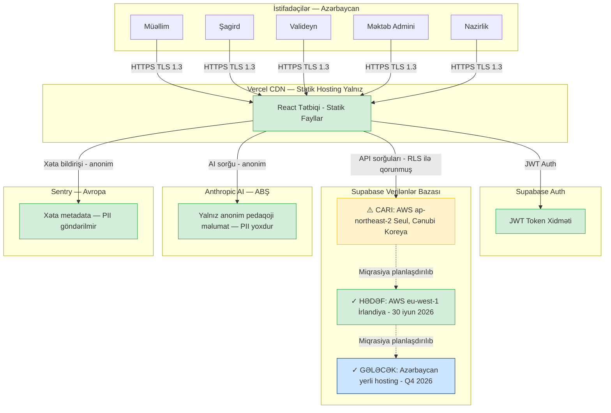

# Məlumatların Qorunması Mexanizmləri
## Zirva Məktəb İdarəetmə Platforması

**Azərbaycan Respublikası Elm və Təhsil Nazirliyinin № VM26005443 (24.04.2026) tarixli məktubuna cavab olaraq təqdim olunur.**

---

**Sənəd istinadı:** ZRV-MSEA-2026-003  
**Təqdimetmə tarixi:** 28 aprel 2026  
**Hazırlayan:** Kaan Guluzada, Qurucu və Baş İcraçı Direktor, Zirva  
**Əlaqə:** hello@tryzirva.com | +994 50 241 14 42 | +994 90 110 66 00  
**Platformanın URL-i:** https://tryzirva.com

---

## Mündəricat

1. [İcraiyyə Xülasəsi](#1-i̇craiyyə-xülasəsi)
2. [Hüquqi Çərçivə](#2-hüquqi-çərçivə)
3. [Toplanan Şəxsi Məlumatlar](#3-toplanan-şəxsi-məlumatlar)
4. [Məlumat Rezidentliyi](#4-məlumat-rezidentliyi)
5. [Məlumatların Minimizasiyası](#5-məlumatların-minimizasiyası)
6. [Saxlama Siyasətləri](#6-saxlama-siyasətləri)
7. [Təhlükəsizlik Tədbirləri](#7-təhlükəsizlik-tədbirləri)
8. [Valideyn Razılığı](#8-valideyn-razılığı)
9. [Məlumat Subyektinin Hüquqları](#9-məlumat-subyektinin-hüquqları)
10. [Pozuntu Bildirişi Proseduru](#10-pozuntu-bildirişi-proseduru)
11. [Üçüncü Tərəflərlə Məlumat Mübadiləsi](#11-üçüncü-tərəflərlə-məlumat-mübadiləsi)
12. [Uşaq Təhlükəsizliyi AI-da](#12-uşaq-təhlükəsizliyi-ai-da)
13. [Məlumat İxracı və Portativliyi](#13-məlumat-i̇xracı-və-portativliyi)
14. [Nazirlik Məlumatlarına Giriş](#14-nazirlik-məlumatlarına-giriş)
15. [Məlumat Axını Diaqramı](#15-məlumat-axını-diaqramı)
16. [Növbəti Addımlar / Tələb Olunan Qərarlar](#16-növbəti-addımlar--tələb-olunan-qərarlar)

---

## 1. İcraiyyə Xülasəsi

Bu sənəd Zirva Məktəb İdarəetmə Platformasının məlumatların qorunması mexanizmlərini təsvir edir. Sənəd Azərbaycan Respublikası Elm və Təhsil Nazirliyinin № VM26005443 (24.04.2026) tarixli müraciətinə şəffaflıq prinsipi əsasında cavab kimi hazırlanmışdır.

**Müzakirə olunan əsas məsələlər:**

Zirva rəhbərliyi bu sənəddə məlumatları açıq və şəffaf şəkildə təqdim edir. Platformanın məlumat rezidentliyi sahəsindəki hazırkı vəziyyəti aşağıda açıq şəkildə bəyan olunur:

Zirva platformasının verilənlər bazası hazırda Amazon Web Services (AWS) **ap-northeast-2** regionunda, yəni **Seul, Cənubi Koreya**da yerləşdirilmişdir. Bu vəziyyət Azərbaycan Respublikasının "Şəxsi məlumatlar haqqında" Qanununun (18.03.1998, №461-IQ) 8-ci maddəsinin tələblərinə uyğun olmaya bilər. Zirva bu riski tam qəbul edir, onun aradan qaldırılması üçün konkret, tarixli bir plan tərtib etmişdir (bax: Bölmə 4) və bu məsələ üzrə Nazirliyin rəhbərliyini gözləyir.

Bütün digər sahələrdə Zirva aşağıdakıları təmin edir:
- Tamamlanmış məlumat minimizasiyası tələblərinə uyğunluq
- Nəqliyyatda TLS 1.3, dayanıqlı məlumatlarda AES-256 şifrələmə
- Sıra səviyyəli təhlükəsizlik vasitəsilə ciddi giriş nəzarəti
- Şəxsən müəyyən edilə bilən məlumatların AI sistemlərinə ötürülməməsi
- 18 yaşından kiçik şagirdlər üçün valideyn razılığı mexanizmi

---

## 2. Hüquqi Çərçivə

### 2.1 Tətbiq Edilən Əsas Qanun

Zirva platforması Azərbaycan Respublikasının aşağıdakı qanun-normativ aktlarının tələbləri çərçivəsində fəaliyyət göstərməlidir:

**"Şəxsi məlumatlar haqqında" Azərbaycan Respublikasının Qanunu**  
Qəbul tarixi: 18 mart 1998  
Nömrəsi: №461-IQ  
(Sonrakı dəyişikliklərlə birlikdə)

### 2.2 Qanun Maddələrinin Zirva Əməliyyatlarına Tətbiqi

| Maddə | Maddə adı | Zirva-ya tətbiqi |
|---|---|---|
| Maddə 1 | Əsas anlayışlar | Platforma "şəxsi məlumat" anlayışına daxil olan bütün kateqoriyaları (ad, doğum tarixi, əlaqə məlumatları, akademik qeydlər) qeydiyyata alır |
| Maddə 3 | Şəxsi məlumatların toplanması məqsədi | Zirva məlumatları yalnız məktəb idarəetməsi, tədris prosesi idarəsi və valideyn məlumatlandırılması məqsədilə toplayır |
| Maddə 4 | Toplanma prinsipləri | Həcm minimizasiyası, məqsəd məhdudluğu, dəqiqlik prinsipi tətbiq edilir |
| Maddə 5 | Razılıq | Qeydiyyat zamanı istifadəçi razılığı alınır; valideyn razılığı 18 yaşdan kiçik şagirdlər üçün tələb olunur |
| Maddə 7 | Üçüncü şəxslərə ötürülmə | Üçüncü tərəf ötürmələri Bölmə 11-də tam açıqlanmışdır |
| Maddə 8 | Transsərhəd ötürmə | **⚠️ Cari vəziyyət: Seul, Cənubi Koreya — aradan qaldırılması tələb olunur; bax Bölmə 4** |
| Maddə 9 | Məlumat subyektinin hüquqları | Bax: Bölmə 9 — tam mexanizm |
| Maddə 11 | Uşaq məlumatlarının qoruması | Bax: Bölmə 8 (valideyn razılığı), Bölmə 12 (AI-da uşaq təhlükəsizliyi) |

### 2.3 Əlavə Tətbiq Edilən Normativ Aktlar

- Azərbaycan Respublikasının "Elektron imza və elektron sənəd haqqında" Qanunu
- Azərbaycan Respublikasının "İnformasiya, informasiyalaşdırma və informasiyanın mühafizəsi haqqında" Qanunu
- Azərbaycan Respublikasının "Təhsil haqqında" Qanunu — tədris qeydlərinin saxlanılması tələbləri
- Azərbaycan Respublikasının «İnformasiya, informasiyalaşdırma və informasiyanın mühafizəsi haqqında» Qanunu (3 aprel 1998-ci il, №474-IQ)

---

## 3. Toplanan Şəxsi Məlumatlar

### 3.1 Şəxsi Məlumat Kateqoriyaları

| Məlumat tipi | Məlumat subyekti | Məqsəd | Saxlama müddəti | Məcburi/İxtiyari |
|---|---|---|---|---|
| Ad, soyad | Bütün istifadəçilər | Platforma girişi, əlaqə | Hesab aktiv olduğu müddət + 1 il | Məcburi |
| E-poçt ünvanı | Bütün istifadəçilər | Giriş, bildiriş | Hesab aktiv olduğu müddət + 1 il | Məcburi |
| Telefon nömrəsi | Müəllimlər, administratorlar | Əlaqə | Hesab aktiv olduğu müddət | İxtiyari |
| Doğum tarixi | Şagirdlər | Yaş doğrulaması, statistika | Tədris müddəti + 5 il | Məcburi |
| Cins | Şagirdlər | Statistik hesabat | Tədris müddəti + 5 il | İxtiyari |
| Akademik qiymətlər | Şagirdlər | Tədris idarəetməsi, hesabat | Daimi (arxiv kimi) | Məcburi |
| Davamiyyət qeydləri | Şagirdlər | İdarəetmə, valideyn məlumatlandırılması | 5 il | Məcburi |
| Mesaj məzmunu | Bütün istifadəçilər | Daxili əlaqə | 2 il | Funksional |
| Giriş vaxtı jurnalı | Bütün istifadəçilər | Audit, təhlükəsizlik | 90 gün | Sistem |
| IP ünvanı | Bütün istifadəçilər | Audit, təhlükəsizlik | 90 gün | Sistem |
| Cihaz məlumatı | Bütün istifadəçilər | Audit, texniki dəstək | 30 gün | Sistem |

### 3.2 Toplanmayan Məlumatlar

Zirva aşağıdakı məlumatları **toplamır:**

- Şəxsiyyət vəsiqəsi / FİN nömrəsi (gələcəkdə Nazirlik inteqrasiyası üçün planlaşdırıla bilər, lakin bu, ayrıca razılıq tələb edir)
- Ödəniş kartı məlumatları (platforma pulsuz, ödəniş sistemi yoxdur)
- Biometrik məlumatlar
- Coğrafi yerləşmə məlumatı (real vaxt GPS)
- Sosial media profil məlumatları
- Tibbi məlumatlar

### 3.3 Məlumatın İşlənmə Hüquqi Əsası

| Məlumat kateqoriyası | Hüquqi əsas |
|---|---|
| Hesab və giriş məlumatları | Xidmət müqaviləsi üçün zəruri |
| Akademik qeydlər | Məktəbin qanuni öhdəliyi + razılıq |
| Davamiyyət qeydləri | Məktəbin qanuni öhdəliyi |
| Audit qeydləri | Qanuni öhdəlik (təhlükəsizlik) |
| Marketinq kommunikasiyası | Açıq razılıq (tələb olunduqda) |

---

## 4. Məlumat Rezidentliyi

### 4.1 Cari Vəziyyətin Bəyanı

> **⚠️ MÜHİM MƏLUMAT — TRANSSƏRHƏDLİ MƏLUMAT MÜBADİLƏSİ RİSKİ**
>
> Zirva platformasının verilənlər bazası hazırda **Supabase** xidmət provayderi vasitəsilə **Amazon Web Services (AWS) ap-northeast-2** regionunda, yəni **Seul, Cənubi Koreya**da yerləşdirilmişdir.
>
> Bu vəziyyət "Şəxsi məlumatlar haqqında" Azərbaycan Respublikasının Qanununun (18.03.1998, №461-IQ) Maddə 8-i ilə tələblərinə uyğun olmaya bilər. Həmin maddə, şəxsi məlumatların Azərbaycan Respublikasından kənara, kifayət qədər qorunma mexanizmi olmayan ölkələrə ötürülməsini məhdudlaşdırır.
>
> Zirva bu riski tam qəbul edir. Aşağıda hərtərəfli aradan qaldırma planı təqdim olunur.

### 4.2 Mövcud Hüquqi Riskin Qiymətləndirilməsi

**Risk səviyyəsi:** Yüksək  
**Əsaslandırma:** Azərbaycan vətəndaşlarına, o cümlədən 18 yaşından kiçik uşaqlara aid şəxsi məlumatlar (adlar, e-poçtlar, akademik qiymətlər, davamiyyət qeydləri) hazırda Cənubi Koreya ərazisindəki serverlərdə saxlanılır. Azərbaycan-Cənubi Koreya arasında şəxsi məlumatların ötürülməsinə dair ikitərəfli müqavilə yoxdur.

**Yüngülləşdirici amillər (mövcud):**
- Bütün məlumatlar AES-256 şifrələmə ilə qorunur
- Supabase SOC 2 Type II sertifikatı tətbiq olunur
- Supabase AWS Frankfurt (EU-West-1) və ya Ireland (EU-West-1) qovşaqlarına miqrasiya infrastrukturuna malikdir
- Supabase GDPR Data Processing Agreement (Məlumat İşləmə Müqaviləsi) imzalanmışdır

### 4.3 Aradan Qaldırma Planı — 4 Mərhələ

#### Mərhələ 1 — EU-West Miqrasiyası (Hədəf: 30 iyun 2026)

**Hədəf:** Supabase verilənlər bazasını AWS ap-northeast-2 (Seul) bölgəsindən AWS eu-west-1 (İrlandiya) və ya eu-central-1 (Frankfurt, Almaniya) bölgəsinə köçürmək.

**Tədbirlər:**
1. Supabase Dashboard-da yeni proje yaradılır (EU-West region)
2. Mövcud məlumatların tam ehtiyat nüsxəsi alınır
3. Sxem miqrasiyası (schema migration) tətbiq edilir
4. Məlumatlar şifrəli kanallar vasitəsilə köçürülür
5. Yeni Supabase URL-i bütün Vercel mühit dəyişənlərində yenilənir
6. DNS TTL azaldılır, A/B testi aparılır
7. Köhnə qovşaq 30 gün keçid müddəti sonunda söndürülür
8. İstifadəçilər e-poçt vasitəsilə məlumatlandırılır

**Müddət:** 3–4 həftə (miqrasiya pəncərəsi akademik tətil dövrünə uyğunlaşdırılır)

**Nəticə:** Avropa İttifaqı GDPR standartlarına uyğun region; Azərbaycan ilə hüquqi çərçivə tətbiq olunur

#### Mərhələ 2 — Məlumat Minimizasiyası Gücləndirilməsi (Hədəf: 30 sentyabr 2026)

**Tədbirlər:**
- Bütün nullable (ixtiyari) şəxsi sahələrin toplanmasının yenidən nəzərdən keçirilməsi
- Şagird məlumatlarının əlavə pseudonimizasiyası (pseudonymization)
- Köhnə audit qeydlərinin avtomatik imhası (purge) cədvəli

#### Mərhələ 3 — Azərbaycan Yerli Hosting (Hədəf: Q4 2026)

**Şərt:** Nazirliyin rəhbərliyinin alınmasından asılıdır.

**Seçim A:** Azərbaycan Respublikasının dövlət buluduna (məs. AZNET, Azərtelekom infrastrukturu) miqrasiya  
**Seçim B:** Bakıda xüsusi data mərkəzinə miqrasiya  
**Seçim C:** Nazirliyin öz serverinə tətbiq  

Zirva bu mərhələdə texniki tərəfdaş kimi Nazirliyin göstərişlərini tam yerinə yetirməyə hazırdır.

#### Mərhələ 4 — Nazirlik İdarəetməsi (Tarix: Nazirlik qərarına əsasən)

Nazirliyin tələbi ilə verilənlər bazasına birbaşa inzibati nəzarət Nazirliyin texniki komandası ilə birgə müəyyənləşdiriləcək.

### 4.4 Aralıq Dövr Yüngülləşdirmə Tədbirləri

Mərhələ 1-in tamamlanmasına qədər (30 iyun 2026) aşağıdakı əlavə yüngülləşdirmə tədbirləri tətbiq olunur:

1. Cənubi Koreya serverlərindəki bütün məlumatlar AES-256 ilə şifrəlidir
2. Verilənlər bazasına birbaşa İnternet girişi bağlıdır; yalnız Supabase API vasitəsilə giriş mümkündür
3. Supabase Data Processing Agreement (Məlumat İşləmə Müqaviləsi) tətbiq olunur
4. Hazırda yalnız pilot məktəblərin sınaq məlumatları sistemdədir (sınaq dövründə real məlumat minimaldır)
5. Pilot başlamazdan əvvəl Nazirliyin yazılı icazəsi tələb olunur

---

## 5. Məlumatların Minimizasiyası

### 5.1 Minimizasiya Prinsipi

Zirva yalnız platforma funksionallığı üçün zəruri olan məlumatları toplayır. "Faydalı ola bilər" düşüncəsi ilə artıq məlumat toplanmır.

**Tətbiq edilən minimizasiya tədbirləri:**

| Sahə | Minimizasiya qərarı |
|---|---|
| Şagird ünvanı | Toplanmır (məktəb artıq regionu bilir) |
| Valideyn peşəsi | Toplanmır (platforma üçün irrelevant) |
| FİN / şəxsiyyət nömrəsi | Toplanmır (Nazirlik inteqrasiyası üçün ayrıca razılıq tələb edər) |
| Şagird fotoşəkli | İxtiyari — şagird/valideyn tərəfindən yüklənir |
| GPS yerləşməsi | Toplanmır |
| Brauzer tarixçəsi | Toplanmır |

### 5.2 AI-da Məlumat Minimizasiyası

Zəka AI köməkçisi hər sorğu üçün ciddi minimizasiya tətbiq edir:

- Sorğuda şəxsi məlumat daxil edilib-edilmədiyini yoxlayan filtr funksiyası (`sanitizeInput`) hər sorğuda işə salınır
- Şagird adları, qiymətlər, şəxsiyyət məlumatları Anthropic API-yə **heç vaxt göndərilmir**
- Yalnız fənn kateqoriyası, sinif səviyyəsi və kurikulum tipi (hamısı anonimdir) göndərilir

---

## 6. Saxlama Siyasətləri

### 6.1 Məlumat Kateqoriyalarına Görə Saxlama

| Məlumat kateqoriyası | Saxlama müddəti | Əsaslandırma |
|---|---|---|
| Akademik qeydlər (qiymətlər, attestatlar) | Daimi (arxiv) | Tədris tarixçəsinin qanuni əhəmiyyəti |
| Davamiyyət qeydləri | 5 il | Statistik/hüquqi tələblər |
| Aktiv hesab məlumatları | Hesab aktiv olduğu müddət + 1 il | Məlumat subyektinin giriş hüququ |
| Silinmiş hesab məlumatları | Silindikdən 30 gün sonra tam silinir | GDPR/şəxsi məlumat qanunu uyğunluğu |
| Mesajlar | 2 il | Kommunikasiya arxivi |
| Bildirişlər | 90 gün | Operasional ehtiyac |
| AI sessiya metadata | 30 gün | Yalnız operasional analitika |
| Giriş audit qeydləri (auth) | 90 gün | Təhlükəsizlik analizi |
| Əməliyyat audit qeydləri | 1 il | Uyğunluq tələbi |
| İnzibati əməliyyat qeydləri | 2 il | Hesabatlılıq |
| Sentry xəta qeydləri | 30 gün | Texniki dəstək |
| Vercel analytics | Anonim, daimi | Performans |

### 6.2 Avtomatik İmha Mexanizmi

Saxlama müddəti bitmiş məlumatların silinməsi Supabase PostgreSQL-in cron job funksionallığı vasitəsilə avtomatik həyata keçirilir:

```sql
-- Hər gecə saat 02:00-da işə salınan job: köhnəlmiş AI sessiyalarını sil
SELECT cron.schedule(
  'ai-session-cleanup',
  '0 2 * * *',
  $$
    DELETE FROM ai_sessions
    WHERE created_at < now() - INTERVAL '30 days';
  $$
);

-- Köhnəlmiş bildirişlər
SELECT cron.schedule(
  'notification-cleanup',
  '0 3 * * *',
  $$
    DELETE FROM notifications
    WHERE created_at < now() - INTERVAL '90 days';
  $$
);
```

---

## 7. Təhlükəsizlik Tədbirləri

### 7.1 Şifrələmə Tədbirlərinin Xülasəsi

| Qat | Texnologiya | Standart |
|---|---|---|
| Nəqliyyat şifrələməsi | TLS 1.3 (TLS 1.2 minimum) | RFC 8446 |
| Dayanıqlı şifrələmə | AES-256-GCM | FIPS 140-2 uyğun |
| Şifrə hashlanması | bcrypt (cost factor 12) | NIST SP 800-63B |
| Açar idarəetməsi | AWS KMS | FIPS 140-2 Level 3 |
| HSTS | max-age=31536000 | NIST SP 800-44 |

### 7.2 Giriş Nəzarəti

Sıra səviyyəli təhlükəsizlik (Row Level Security, RLS) vasitəsilə:

- Hər istifadəçi yalnız öz məlumatlarına giriş edə bilərlər
- Müəllim yalnız öz sinifinin məlumatlarına giriş edə bilərlər
- Valideyn yalnız öz övladının məlumatlarına giriş edə bilərlər
- Nazirlik yalnız oxuma rejimindədir; yazma icazəsi yoxdur

Ətraflı məlumat üçün ZRV-MSEA-2026-002 nömrəli Təhlükəsizlik Arxitekturası sənədinə müraciət edin.

---

## 8. Valideyn Razılığı

### 8.1 Uşaq Məlumatları Üçün Razılıq Axını

"Şəxsi məlumatlar haqqında" Qanununun Maddə 11-i uşaqların məlumatlarının qorunması üçün xüsusi tədbirlər tələb edir.

18 yaşından kiçik şagirdlər üçün qeydiyyat axını:

```
Addım 1: Məktəb administratoru şagird hesabı yaradır
         → Valideyn e-poçtu daxil edilir

Addım 2: Valideynə razılıq e-poçtu göndərilir
         → EmailJS vasitəsilə
         → E-poçtda platformanın funksionallığı, 
           toplanan məlumatlar, saxlama müddəti açıqlanır

Addım 3: Valideyn razılıq linkini izləyir
         → "Razıyam" düyməsini klikləyir
         → parent_consent cədvəlində qeyd yaranır:
           {student_id, parent_id, consent_at, ip_address, user_agent}

Addım 4: Şagird hesabı aktiv olur
         → Valideyn razılığı olmadan şagird hesabı aktiv deyil

Addım 5: Valideyn istənilən vaxt razılığı geri götürə bilər
         → Hesabın və məlumatların silinməsini tələb edə bilər
```

### 8.2 Razılığın Sübutu

Hər valideyn razılığı aşağıdakı məlumatlarla qeydə alınır:
- Razılıq tarixi və vaxtı
- IP ünvanı (coğrafi doğrulama üçün)
- Brauzer/cihaz məlumatı (user agent)
- Razılıq verilən platforma versiyası (şərtlər dəyişdikdə yenidən razılıq tələb edilsin deyə)

---

## 9. Məlumat Subyektinin Hüquqları

### 9.1 Qanun ilə Tanınan Hüquqlar

"Şəxsi məlumatlar haqqında" Qanunun tələblərinə uyğun olaraq, hər istifadəçi aşağıdakı hüquqlara malikdir:

| Hüquq | Təsvir | Zirva-da icra mexanizmi |
|---|---|---|
| **Giriş hüququ** | Haqqında saxlanılan bütün məlumatlara baxmaq | Platforma daxilindən "Məlumatlarımı ixrac et" funksiyası; e-poçt sorğusu ilə 30 gün ərzində cavab |
| **Düzəliş hüququ** | Yanlış məlumatların düzəldilməsi | Profil redaktə funksiyası; qiymət/davamiyyət üçün administrator vasitəsilə |
| **Silinmə hüququ** | Məlumatların silinməsini tələb etmək | E-poçt sorğusu ilə 30 gün ərzində; akademik qeydlər qanuni öhdəlik üçün saxlanıla bilər |
| **Portativlik hüququ** | Məlumatları maşın oxunaqlı formada almaq | JSON / CSV ixrac funksiyası |
| **Etiraz hüququ** | Müəyyən məlumat işlənməsinə etiraz | E-poçt vasitəsilə, 15 iş günü ərzində cavab |
| **İşlənməni məhdudlaşdırma hüququ** | Müəyyən məlumatların işlənməsini dayandırmaq | E-poçt sorğusu ilə, 15 iş günü ərzində cavab |

### 9.2 Sorğuların İşlənmə Proseduru

Bütün məlumat hüququ sorğuları **hello@tryzirva.com** ünvanına göndərilir.

**Cavab müddətləri:**
- İlk cavab (qəbul bildirişi): 3 iş günü
- Tam cavab (giriş/ixrac): 30 gün
- Tam cavab (silinmə/düzəliş): 30 gün
- Etiraz (mürəkkəb hallar üçün uzadıla bilər): 45 gün

Sorğunu yerinə yetirən şəxsin şəxsiyyəti doğrulanır; hesabda qeydli e-poçt ünvanından göndərilmiş sorğular qəbul olunur.

---

## 10. Pozuntu Bildirişi Proseduru

### 10.1 Məlumat Pozuntusu Reaksiya Cədvəli

| Addım | Fəaliyyət | Məsul şəxs | Müddət |
|---|---|---|---|
| 1 — Aşkarlanma | Pozuntu Sentry, audit jurnalı və ya istifadəçi bildirişi vasitəsilə müəyyən edilir | Texniki komanda | Dərhal |
| 2 — Qiymətləndirmə | Pozuntunun həcmi, əhatəsi və şiddəti müəyyən edilir (P1/P2/P3) | Kaan Guluzada | İlk 2 saat |
| 3 — Məhdudlaşdırma | Zərərli giriş nöqtəsi bağlanır, zərərli hesablar deaktivləşdirilir | Texniki komanda | İlk 4 saat |
| 4 — Sənədləşdirmə | Pozuntunun texniki detalları qeydə alınır | Texniki komanda | İlk 24 saat |
| 5 — Nazirlik Bildirişi | P1 pozuntu: Nazirlik 72 saat ərzində yazılı şəkildə məlumatlandırılır | Kaan Guluzada | 72 saat ərzində |
| 6 — İstifadəçi Bildirişi | Təsirə məruz qalan istifadəçilər e-poçt vasitəsilə məlumatlandırılır | Zirva komandası | 72 saat ərzində |
| 7 — Aradan Qaldırma | Kök səbəb (root cause) aradan qaldırılır, sistem bərpa olunur, post-mortem yazılır | Texniki komanda | 5 iş günü ərzində |

### 10.2 P1 (Kritik) Pozuntu Bildiriş Məzmunu

Nazirliyin bildirişi aşağıdakı məlumatları ehtiva edəcək:
- Pozuntunun aşkarlandığı tarix və vaxt
- Etkilənən məlumat kateqoriyaları
- Etkilənən istifadəçi/şagird sayının təxmini hesabı
- Pozuntunun mümkün təsirlərinin qiymətləndirilməsi
- Görülmüş ani tədbirlər
- Gözlənilən tam bərpa tarixi
- Növbəti 24 saatlıq plan

---

## 11. Üçüncü Tərəflərlə Məlumat Mübadiləsi

### 11.1 Üçüncü Tərəf Provayderlər Cədvəli

| Provayder | Xidmət | Göndərilən məlumat | GÖNDƏRİLMƏYƏN məlumat | Region | Hüquqi əsas |
|---|---|---|---|---|---|
| **Anthropic** | Zəka AI API | Fənn konteksti (anonim), kurikulum tipi, sinif səviyyəsi, pedaqoji sual | Şagird adı, qiymət, şəxsiyyət məlumatı, müəllim adı, məktəb adı | ABŞ | Xidmət müqaviləsi, PII göndərilmir |
| **Supabase** | Verilənlər bazası, auth | Bütün platforma məlumatları (şifrəli) | — | Seul ⚠️ → EU (planlı) | Data Processing Agreement |
| **Vercel** | Statik hosting, CDN | Heç bir şəxsi məlumat (yalnız statik fayllar) | Bütün şəxsi məlumatlar | ABŞ + EU | Xidmət şərtləri, SOC 2 |
| **Sentry** | Xəta izləmə | Brauzer xətaları, URL yolu, brauzer tipi | İstifadəçi adı, şifrə, qiymət, mesaj məzmunu | Avropa | Məlumat işləmə müqaviləsi |
| **EmailJS** | E-poçt bildirişi | Alıcı e-poçtu, bildiriş mətni | Qiymətlər, tam tədris tarixçəsi | ABŞ | Xidmət şərtləri |

### 11.2 Anthropic İlə Ətraflı Açıqlama

Anthropic Claude API istifadəsinin şəffaflığı məsələsini açıq şəkildə bəyan etmək vacibdir:

**GÖNDƏRİLƏN:**
- Müəllimin yazdığı pedaqoji sual (məs. "Bu mövzunu necə izah edim?")
- Fənn kateqoriyası (məs. "riyaziyyat")
- Sinif nömrəsi (məs. "7")
- Kurikulum tipi (məs. "milli")
- Sabit sistem promptu (ümumi Azərbaycan məktəb konteksti)

**GÖNDƏRİLMƏYƏN:**
- Heç bir şagirdin adı, soyadı, FİN, şəxsiyyəti
- Heç bir şagirdin qiymətləri və ya akademik tarixçəsi
- Müəllimin adı, soyadı, e-poçtu
- Məktəbin adı, kodu, ünvanı
- Valideyn məlumatları
- Hər hansı şəxsən müəyyən edilə bilən məlumat (PII)

**Anthropic saxlama siyasəti:**
Anthropic, Business/API müştərilərinin sorğularını model məşqi üçün istifadə etmir. Sorğular 30 gün ərzindəki təhlükəsizlik/uyğunluq məqsədləri üçün saxlanıla bilər, sonra silinir.

---

## 12. Uşaq Təhlükəsizliyi AI-da

### 12.1 18 Yaşından Kiçik Şagirdlər üçün AI Qoruması

Zirva-da AI köməkçisi (Zəka) şagirdlərə deyil, yalnız müəllimlərə açıqdır. Bu, dizayn əsaslı qorumadır:

| Rol | AI girişi | Əsaslandırma |
|---|---|---|
| Müəllim | ✓ Tam giriş | Pedaqoji alət |
| Məktəb Administratoru | ✓ Tam giriş | İdarəetmə dəstəyi |
| Nazirlik | ✓ Tam giriş | Analitik dəstək |
| Şagird | ✗ Giriş yoxdur | Uşaq qoruması |
| Valideyn | ✗ Giriş yoxdur | Hazırda planlaşdırılmamışdır |

Bu yanaşma, uşaqların bilavasitə xarici AI sistemləri ilə əlaqəyə girməsinin qarşısını alır.

### 12.2 Uşaq Məlumatlarının AI-a Ötürülməməsi

Müəllim AI-a sual verərkən texniki olaraq şagird məlumatlarını göndərə bilməz; sanitizasiya funksiyası bunu sistem səviyyəsindəki filtrasiya ilə bloklayır. Nümunə:

```javascript
function sanitizeInput(input) {
  // Şəxsi ad, soyad, FİN nümunəsi aşkarlanarsa xəbərdarlıq et
  const piiPatterns = [
    /\b\d{7}\b/,           // FİN nömrəsi şablonu
    /qiymət[:;]\s*\d+/i,  // "qiymət: 85" şablonu
    // ... əlavə şablonlar
  ];
  // Şübhəli məlumat varsa sorğu rədd edilir
}
```

---

## 13. Məlumat İxracı və Portativliyi

### 13.1 İstifadəçi Məlumatlarını İxrac Et

Hər istifadəçi öz platformadakı bütün məlumatlarını ixrac edə bilərlər:

**Formalar:**
- **JSON:** Maşın oxunaqlı tam məlumat dəsti
- **CSV:** Excel-uyğun cədvəl formatı
- **PDF:** İnsanın oxunaqlı formatda hesabat (jsPDF kitabxanası vasitəsilə)

**Əhatə olunan məlumatlar:**
- Profil məlumatları
- Bütün qiymətlər (tarix, fənn, müəllim, qiymət, şərh)
- Davamiyyət tarixçəsi
- Göndərilmiş / alınmış mesajlar
- Bildiriş tarixçəsi

**İxrac müddəti:** Sorğudan 48 saat ərzində sistem tərəfindən avtomatik hazırlanır.

### 13.2 Məktəb Səviyyəsindəki İxrac

Məktəb administratorları məktəbləri üçün toplu məlumat ixracı həyata keçirə bilərlər; bu, başqa sistemlərə miqrasiya üçün faydalıdır.

### 13.3 Nazirlik Səviyyəsindəki İxrac

Nazirlik istifadəçiləri analitik hesabat formalarında (PDF, Excel) məlumat ixracı edə bilərlər. Nazirliyin tələbi ilə xam verilənlər bazası ixracı (PostgreSQL dump) da mümkündür.

---

## 14. Nazirlik Məlumatlarına Giriş

### 14.1 Nazirlik Rolunun Görüntüləyə Bildiyi Məlumatlar

Nazirlik (`ministry`) roluna sahib istifadəçilər aşağıdakı məlumatlara **yalnız oxuma** girişinə malikdirlər:

- Bütün məktəblərin statistik göstəriciləri
- Bütün məktəblərin ümumi qiymət statistikası (ayrı-ayrı şagird qiymətlərini görmə imkanı var)
- Bütün məktəblərin davamiyyət statistikası
- Platforma istifadə statistikası (aktiv istifadəçi sayı, giriş tezliyi)
- Toplu analitika hesabatları

### 14.2 Nazirlik Rolunun GÖRƏ BİLMƏDİYİ Məlumatlar

- Valideyn-müəllim mesajlaşmaları
- Fərdi istifadəçi şifrələri (heç kim, o cümlədən Zirva da görə bilmir)
- AI sessiya məzmunları (yalnız anonim metadata)

### 14.3 Nazirlik Hesabı Yaradılması

Nazirlik hesabları yalnız Zirva komandası tərəfindən yaradılır. Heç bir şəxs `ministry` rolunu özü üçün tələb edə bilməz. Pilot proqramı üçün Nazirliyin göstərdiyi şəxslər üçün `ministry` rolu ilə hesablar yaradılacaq.

---

## 15. Məlumat Axını Diaqramı



---

## 16. Növbəti Addımlar / Tələb Olunan Qərarlar

Azərbaycan Respublikası Elm və Təhsil Nazirliyi aşağıdakı məsələlər üzrə rəsmi mövqe bildirməsi xahiş olunur:

| № | Sual | Qərar növü |
|---|---|---|
| 1 | **EU-West miqrasiyası:** Nazirlik, Zirvanın 30 iyun 2026 hədəf tarixi ilə AWS EU-West regionuna miqrasiyasını pilot başlanğıcı üçün kifayət qədər yüngülləşdirici təddir kimi qəbul edirmi? | Rəsmi cavab tələb olunur |
| 2 | **Yerli hosting tələbləri:** Mərhələ 3 üçün — Azərbaycan yerli hosting variantı üçün Nazirliyin tövsiyə etdiyi infrastruktur provayderi, texniki tələblər və vaxt çizelgesi nədir? | Texniki brifing tələb olunur |
| 3 | **Uşaq məlumatları üçün əlavə tələblər:** "Şəxsi məlumatlar haqqında" Qanununun Maddə 11-i çərçivəsində Nazirliyin 18 yaşından kiçik uşaqların məlumatlarının qorunması üçün əlavə xüsusi tələbləri varmı? | Hüquqi brifing tələb olunur |
| 4 | **Nazirlik DPA:** Zirva ilə Nazirlik arasında rəsmi bir Məlumat İşləmə Müqaviləsi (Data Processing Agreement) imzalanması nəzərdə tutulurmu? Əgər bəli isə, Nazirliyin standart DPA şablonu tətbiq olunurmu? | Hüquqi sənəd tələb olunur |

---

*Bu sənəd Zirva şirkəti tərəfindən Azərbaycan Respublikası Elm və Təhsil Nazirliyinin № VM26005443 (24.04.2026) tarixli müraciətinə cavab olaraq hazırlanmışdır.*

*Sənəd istinadı: ZRV-MSEA-2026-003 | Tarix: 28 aprel 2026*

*Kaan Guluzada*  
*Qurucu və Baş İcraçı Direktor, Zirva*  
*hello@tryzirva.com | +994 50 241 14 42 | +994 90 110 66 00*  
*https://tryzirva.com*
