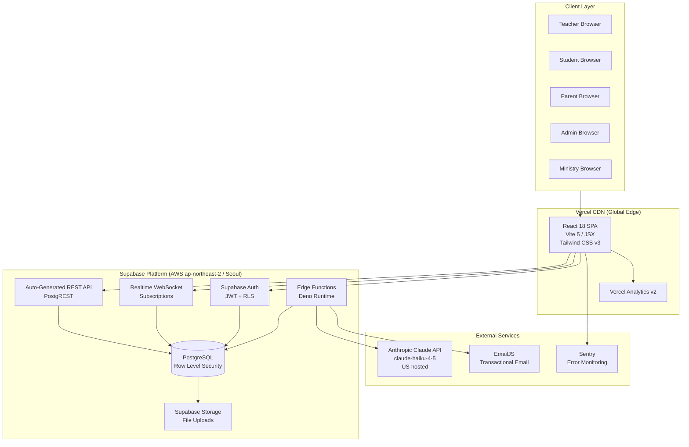
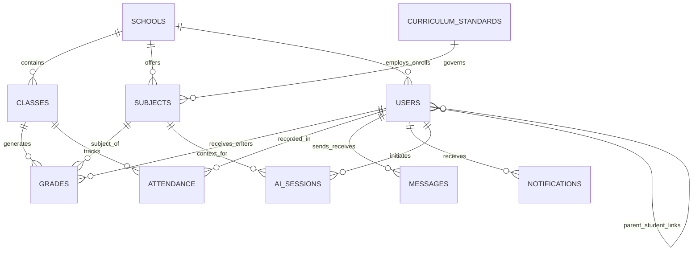
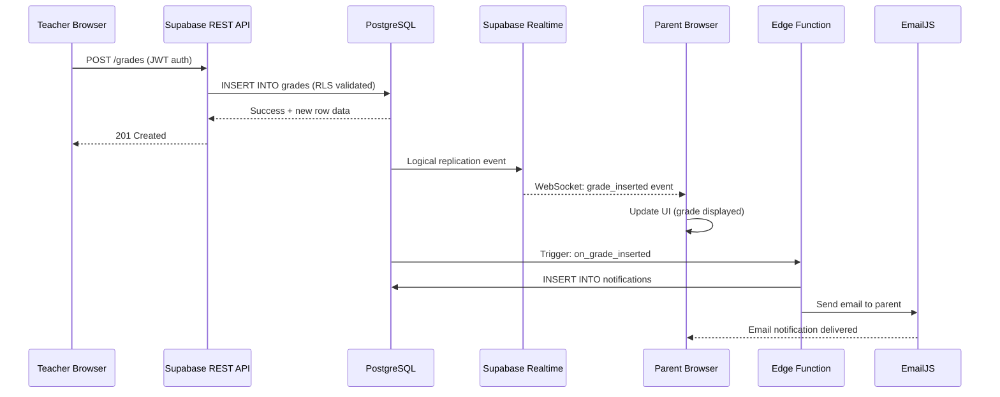
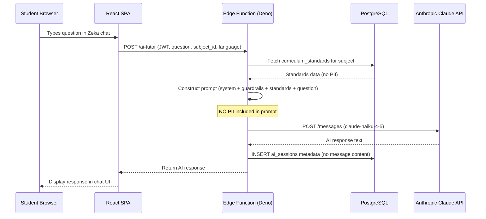
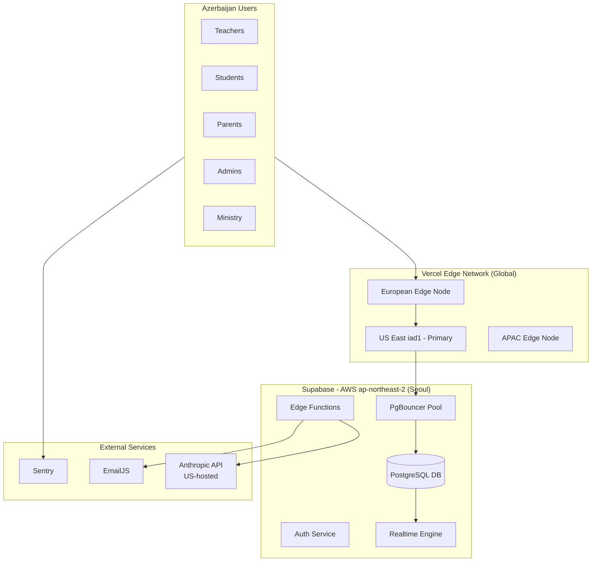

# Technical Documentation
## Zirva School Management Platform

**Submitted in response to letter № VM26005443 dated 24 April 2026 from the Ministry of Science and Education of the Republic of Azerbaijan.**

---

**Document reference:** ZRV-MSEA-2026-001  
**Date of submission:** 28 April 2026  
**Prepared by:** Kaan Guluzada, Founder & CEO, Zirva  
**Contact:** hello@tryzirva.com | +994 50 241 14 42 | +994 90 110 66 00  
**Platform URL:** https://tryzirva.com

---

## Executive Summary

Zirva is a cloud-based school management platform designed and built to serve the full operational and pedagogical needs of Azerbaijan's state school system alongside internationally accredited institutions. The platform is currently live and deployed at tryzirva.com, providing digital gradebook management, attendance tracking, real-time parent notifications, school administrator dashboards, a Ministry-level national reporting dashboard aggregating data across all connected schools, and an AI-powered tutoring assistant ("Zəka") available in Azerbaijani, English, and Russian. The platform is designed to scale to 4,700 state schools, 1.8 million students, and approximately 150,000 teachers across Azerbaijan, and natively supports both the Azerbaijan national curriculum and all four programmes of the International Baccalaureate (IB) — PYP, MYP, DP, and CP — on a single unified database schema. This document provides a comprehensive technical description of the system architecture, data model, security controls, and deployment topology, submitted in response to the Ministry's letter of 24 April 2026.

---

## Table of Contents

1. System Overview
2. Architecture Description
3. Technology Stack
4. Database Schema
5. Role-Based Access Control
6. Real-Time Data Flow
7. Zəka AI Tutor Architecture
8. Dual-Curriculum Support
9. API Surface
10. Deployment Topology
11. Scalability and Performance
12. Data Residency and Security
13. Next Steps / Requested Decisions

---

## 1. System Overview

### 1.1 Purpose and Scope

Zirva is a unified, multi-tenant school management information system (SMIS) intended to replace fragmented, paper-based, or legacy digital processes across Azerbaijan's educational institutions. The platform serves five distinct user roles — Teacher, Student, Parent, School Administrator, and Ministry Official — each with a purpose-built interface and access control boundary.

The system is designed from the ground up for the following operational requirements:

- High-volume concurrent access during school hours (up to 1.8 million students and 150,000 teachers simultaneously)
- Real-time data propagation from teacher input to parent notification within seconds
- Compliance with both national curriculum frameworks and international accreditation standards (IB)
- A Ministry-level analytics layer that aggregates performance data across all connected schools without exposing individual student records to unauthorised parties
- An AI-powered tutoring assistant that operates entirely within safe, curriculum-aligned guardrails

### 1.2 Current Deployment Status

The platform is currently live and deployed at tryzirva.com. The frontend application is served globally via Vercel's Content Delivery Network (CDN), with the primary compute region in US East (iad1) and European edge nodes available. The database is hosted on Supabase, currently provisioned in the AWS ap-northeast-2 region (Seoul, South Korea). A data residency migration to a European or local region is technically feasible and is among the decisions requested from the Ministry in Section 13 of this document.

---

## 2. Architecture Description

### 2.1 High-Level Architecture

Zirva follows a modern serverless, API-first architecture. There is no traditional dedicated application server. All backend logic is handled through three mechanisms:

1. **Supabase Auto-Generated REST API** — Supabase exposes a fully typed RESTful API for all database tables, governed by Row Level Security (RLS) policies.
2. **Supabase Realtime** — A WebSocket-based subscription layer that pushes database change events to connected clients in real time.
3. **Supabase Edge Functions** — Serverless functions running on the Deno runtime, deployed at the edge, used for complex business logic, AI proxy calls, and webhook integrations.

The frontend is a single-page application (SPA) built with React 18 and bundled with Vite 5, hosted on Vercel CDN.

### 2.2 System Architecture Diagram

### 2.3 Request Lifecycle

A typical user interaction — for example, a teacher submitting a grade — follows this path:

1. The teacher interacts with the React SPA in their browser.
2. The SPA makes an authenticated HTTPS POST request to the Supabase REST API endpoint, attaching a JWT token issued by Supabase Auth.
3. PostgREST (the middleware layer within Supabase) validates the JWT, applies the relevant Row Level Security policy, and executes the SQL write against the PostgreSQL database.
4. The database write triggers a Supabase Realtime event, which is broadcast via WebSocket to all subscribed clients (e.g., the parent's browser session and the admin dashboard).
5. Simultaneously, a database trigger or Edge Function dispatches a notification via EmailJS to the parent's registered email address.
6. The parent's browser, already subscribed to the Realtime channel for their child's records, receives the grade event within milliseconds and updates the UI without a page refresh.

---

## 3. Technology Stack

### 3.1 Stack Overview Table

| Layer | Technology | Version | Purpose |
|---|---|---|---|
| Frontend Framework | React | 18.x | Component-based UI |
| Build Tool | Vite | 5.x | Fast module bundler and dev server |
| Language | JavaScript (JSX) | ES2022+ | Frontend logic and components |
| Routing | React Router | v6 | Client-side navigation |
| Styling | Tailwind CSS | v3 | Utility-first CSS framework |
| UI Icons | Lucide React | Latest | Icon library |
| Charts & Analytics UI | Recharts | Latest | Data visualisation components |
| PDF Generation | jsPDF + jsPDF-AutoTable | Latest | Client-side PDF export (reports, certificates) |
| Database Client | @supabase/supabase-js | v2 | Database access, auth, realtime |
| Error Monitoring | Sentry (@sentry/react) | v8 | Frontend error tracking and alerting |
| Analytics | @vercel/analytics | v2 | Page view and event analytics |
| Email | EmailJS | Latest | Transactional email dispatch |
| Frontend Hosting | Vercel CDN | — | Global static + edge deployment |
| Database | Supabase (PostgreSQL) | PostgreSQL 15+ | Primary data store |
| Backend Runtime | Supabase Edge Functions | Deno 1.x | Serverless business logic |
| AI Model | Anthropic Claude API | claude-haiku-4-5 | AI tutoring (Zəka) |
| Auth | Supabase Auth | — | JWT-based authentication with RLS |

### 3.2 Dependency Notes

No proprietary server-side framework is used. All backend state management is handled within PostgreSQL via stored procedures, triggers, and Row Level Security policies. This architecture minimises operational complexity and eliminates the need for a separately managed application server, reducing attack surface and operational overhead.

---

## 4. Database Schema

### 4.1 Overview

The Zirva PostgreSQL database [FILL IN: Supabase project ID] contains [FILL IN: exact table count] tables. The schema is organised around a multi-tenant model in which every record is scoped to a `school_id`, enabling strict data isolation between institutions while allowing the Ministry-level dashboard to run aggregate queries across the entire tenant population with appropriate access controls.

The following subsections describe the primary tables, their key columns, and their relationships.

### 4.2 Core Tables

#### 4.2.1 `users`

Stores all platform users regardless of role. Extended profile data (teacher qualifications, student year group, parent relationships) is stored in role-specific tables that reference this table.

| Column | Type | Description |
|---|---|---|
| id | UUID (PK) | Unique user identifier, references Supabase Auth UID |
| email | TEXT | Login email address |
| full_name | TEXT | Display name |
| role | ENUM | One of: `teacher`, `student`, `parent`, `school_admin`, `ministry` |
| school_id | UUID (FK) | Foreign key to `schools`; NULL for Ministry users |
| language_preference | TEXT | Preferred UI language: `az`, `en`, `ru` |
| created_at | TIMESTAMPTZ | Record creation timestamp |
| updated_at | TIMESTAMPTZ | Last modification timestamp |
| is_active | BOOLEAN | Soft-delete / account status flag |

#### 4.2.2 `schools`

Stores all registered educational institutions.

| Column | Type | Description |
|---|---|---|
| id | UUID (PK) | Unique school identifier |
| name | TEXT | Official school name |
| region | TEXT | Administrative region (rayon) |
| school_type | ENUM | `state` or `private` |
| curriculum_type | ENUM | `national`, `ib`, `both` |
| ministry_code | TEXT | Official Ministry registration code |
| address | TEXT | Physical address |
| principal_user_id | UUID (FK) | Reference to `users` for the principal |
| created_at | TIMESTAMPTZ | Record creation timestamp |
| is_active | BOOLEAN | Operational status |

#### 4.2.3 `classes`

Represents individual class groups within a school.

| Column | Type | Description |
|---|---|---|
| id | UUID (PK) | Unique class identifier |
| school_id | UUID (FK) | Parent school |
| name | TEXT | Class name (e.g., "10A", "Year 11 MYP") |
| academic_year | TEXT | Academic year string (e.g., "2025-2026") |
| teacher_id | UUID (FK) | Homeroom or class teacher |
| curriculum_type | ENUM | `national` or `ib` — determines grading engine |
| grade_level | INTEGER | Year/grade number |
| created_at | TIMESTAMPTZ | Record creation timestamp |

#### 4.2.4 `subjects`

Catalogue of subjects, linked to curriculum standards.

| Column | Type | Description |
|---|---|---|
| id | UUID (PK) | Unique subject identifier |
| name | TEXT | Subject name |
| school_id | UUID (FK) | Owning school |
| curriculum_type | ENUM | `national` or `ib` |
| ib_programme | ENUM | `pyp`, `myp`, `dp`, `cp`, NULL for national |
| subject_code | TEXT | Internal or official subject code |
| standards_set_id | UUID (FK) | Reference to `curriculum_standards` |
| created_at | TIMESTAMPTZ | Record creation timestamp |

#### 4.2.5 `grades`

Central gradebook table. Stores individual assessment results.

| Column | Type | Description |
|---|---|---|
| id | UUID (PK) | Unique grade record identifier |
| student_id | UUID (FK) | Reference to `users` (student) |
| subject_id | UUID (FK) | Reference to `subjects` |
| class_id | UUID (FK) | Reference to `classes` |
| teacher_id | UUID (FK) | Grading teacher |
| score | NUMERIC | Raw score value |
| max_score | NUMERIC | Maximum possible score |
| grade_label | TEXT | Descriptive label (e.g., "A", "5", "Merit") |
| assessment_type | TEXT | E.g., "quiz", "exam", "project", "criterion_a" |
| curriculum_type | ENUM | `national` or `ib` — drives display logic |
| term | TEXT | Academic term or semester |
| graded_at | TIMESTAMPTZ | Timestamp of grade entry |
| notes | TEXT | Teacher notes (optional) |

#### 4.2.6 `attendance`

Records daily or per-lesson attendance.

| Column | Type | Description |
|---|---|---|
| id | UUID (PK) | Unique attendance record |
| student_id | UUID (FK) | Reference to `users` (student) |
| class_id | UUID (FK) | Reference to `classes` |
| subject_id | UUID (FK) | Reference to `subjects` (optional) |
| teacher_id | UUID (FK) | Recording teacher |
| date | DATE | Calendar date |
| period | TEXT | Lesson period identifier (optional) |
| status | ENUM | `present`, `absent`, `late`, `excused` |
| notes | TEXT | Optional note (e.g., medical excuse) |
| created_at | TIMESTAMPTZ | Record creation timestamp |

#### 4.2.7 `messages`

Secure internal messaging between users.

| Column | Type | Description |
|---|---|---|
| id | UUID (PK) | Unique message identifier |
| sender_id | UUID (FK) | Sending user |
| recipient_id | UUID (FK) | Receiving user |
| subject | TEXT | Message subject |
| body | TEXT | Message content |
| is_read | BOOLEAN | Read status |
| created_at | TIMESTAMPTZ | Send timestamp |

#### 4.2.8 `notifications`

System-generated event notifications pushed to users.

| Column | Type | Description |
|---|---|---|
| id | UUID (PK) | Unique notification identifier |
| user_id | UUID (FK) | Target user |
| type | TEXT | Notification type (e.g., `grade_posted`, `absence_recorded`) |
| title | TEXT | Short notification title |
| body | TEXT | Notification body text |
| reference_id | UUID | ID of the triggering record (grade, attendance, etc.) |
| is_read | BOOLEAN | Read status |
| created_at | TIMESTAMPTZ | Creation timestamp |

#### 4.2.9 `ai_sessions`

Logs AI tutor (Zəka) interactions. No personally identifying content from conversations is stored permanently; only metadata.

| Column | Type | Description |
|---|---|---|
| id | UUID (PK) | Unique session identifier |
| student_id | UUID (FK) | Reference to `users` (student) |
| subject_id | UUID (FK) | Subject context of the session |
| curriculum_type | ENUM | `national` or `ib` |
| language | TEXT | Session language: `az`, `en`, `ru` |
| message_count | INTEGER | Number of exchanges in the session |
| started_at | TIMESTAMPTZ | Session start timestamp |
| ended_at | TIMESTAMPTZ | Session end timestamp |
| [FILL IN: additional metadata columns] | | |

### 4.3 Supporting Tables

In addition to the core tables above, the schema includes:

- `curriculum_standards` — Stores learning outcome standards for both national and IB curricula
- `parent_student_links` — Many-to-many join table linking parent users to student users
- `teacher_class_assignments` — Links teachers to classes and subjects
- `school_admin_assignments` — Links admin users to schools
- `academic_terms` — Defines the academic calendar structure per school
- `[FILL IN: additional tables for timetabling, resource management, etc.]`

### 4.4 Schema Relationship Diagram

---

## 5. Role-Based Access Control

### 5.1 Access Control Model

Zirva implements a layered access control model combining:

1. **Supabase Auth (JWT)** — Every request carries a signed JWT identifying the user and their role.
2. **Row Level Security (RLS) Policies** — PostgreSQL RLS policies enforce access at the database row level, ensuring that even if API requests are crafted manually, a user can only read or write records they are authorised to access.
3. **Application-Level Route Guards** — The React SPA enforces role-based routing, presenting only the appropriate interface components for each role.

### 5.2 Role Permission Matrix

| Permission | Teacher | Student | Parent | School Admin | Ministry |
|---|---|---|---|---|---|
| View own grades | — | Yes | Via child | — | — |
| View grades for own class | Yes | — | — | Yes | Aggregate only |
| Enter/edit grades | Yes (own classes) | No | No | No | No |
| View attendance | Yes (own classes) | Own only | Via child | All (own school) | Aggregate only |
| Record attendance | Yes (own classes) | No | No | No | No |
| Send messages | Yes | Yes | Yes | Yes | No |
| View school-wide reports | No | No | No | Yes | All schools |
| Manage user accounts | No | No | No | Yes (own school) | Read only |
| Access national dashboard | No | No | No | No | Yes |
| Use Zəka AI tutor | Limited | Yes | No | No | No |
| Configure curriculum settings | No | No | No | Yes (own school) | No |
| Export PDF reports | Yes (own classes) | Own only | Via child | Yes (own school) | Yes (national) |

### 5.3 Row Level Security Policy Examples

RLS policies are defined directly in PostgreSQL. Representative examples:

- **Grades table (teacher access):** `USING (teacher_id = auth.uid() OR school_admin_check(auth.uid(), school_id))`
- **Grades table (student access):** `USING (student_id = auth.uid())`
- **Schools table (Ministry access):** `USING (auth.jwt() ->> 'role' = 'ministry')` — grants read access to all school records
- **ai_sessions (student access):** `USING (student_id = auth.uid())` — students can only see their own sessions

---

## 6. Real-Time Data Flow

### 6.1 Description

Zirva uses Supabase Realtime to propagate database changes to connected clients without polling. The system subscribes to PostgreSQL logical replication events and broadcasts them over WebSocket connections to authenticated clients.

Key real-time flows:

- **Grade posting:** Teacher enters a grade → database write → Realtime event broadcast → parent's browser updates immediately → notification record created → EmailJS sends email to parent
- **Attendance recording:** Teacher marks attendance → database write → school admin dashboard updates in real time → parent notified of absence if applicable
- **Message delivery:** User sends message → database write → recipient's notification badge increments in real time

### 6.2 Real-Time Data Flow Diagram

### 6.3 Subscription Model

Clients subscribe to Realtime channels scoped by their access level:

- Students subscribe to `grades:student_id=eq.{their_id}` and `attendance:student_id=eq.{their_id}`
- Parents subscribe to channels for each of their linked children
- School admins subscribe to school-wide channels filtered by `school_id`
- Ministry officials subscribe to aggregate channels with no individual student data exposed

---

## 7. Zəka AI Tutor Architecture

### 7.1 Overview

Zəka is the AI-powered tutoring assistant integrated into the student portal. It is powered by the Anthropic Claude API (model: `claude-haiku-4-5`) and is available to all students free of charge. The assistant supports three languages — Azerbaijani (AZ), English (EN), and Russian (RU) — and operates within strict curriculum-aligned guardrails to ensure pedagogically appropriate interactions.

### 7.2 Prompt Construction

AI requests are proxied through a Supabase Edge Function (Deno runtime) rather than called directly from the browser. This ensures that the Anthropic API key is never exposed to the client. The Edge Function constructs a prompt using the following components:

**System prompt includes:**
- The student's current subject and curriculum type (`national` or IB programme)
- The applicable curriculum standards for that subject and year level (fetched from `curriculum_standards` table)
- The session language (AZ/EN/RU)
- Pedagogical guardrails (e.g., "assist the student in understanding the concept; do not provide direct answers to assessment questions")
- Safety guidelines (age-appropriate content, no political content, no content outside curriculum scope)

**User message includes:**
- The student's question as typed

### 7.3 What Is NOT Sent to Anthropic

To protect student privacy, the following data is explicitly excluded from all Anthropic API calls:

- Student name, email address, or any other personally identifiable information (PII)
- Student's grade history or attendance records
- School name or school identifier
- Parent contact information
- Any data from other students
- Any data from the `users`, `grades`, `attendance`, `messages`, or `notifications` tables

The Edge Function enforces this by constructing the prompt from a whitelist of approved context fields only. PII filtering is applied programmatically before the API call is dispatched.

### 7.4 Data Retention

- AI conversation turns are not permanently stored in the database.
- Only session metadata (session ID, subject, language, message count, start/end timestamps) is stored in the `ai_sessions` table — see Section 4.2.9.
- Anthropic's API processes messages transiently and does not retain them for training purposes under the current enterprise API agreement.

### 7.5 Zəka Architecture Diagram

---

## 8. Dual-Curriculum Support

### 8.1 Design Philosophy

Zirva was designed from the outset to serve both Azerbaijan state schools operating under the national curriculum and private or international schools offering IB programmes. Rather than maintaining two separate systems, a single unified schema supports both curriculum types through a `curriculum_type` field present on key tables.

### 8.2 Schema-Level Implementation

The `curriculum_type` ENUM field (`national` | `ib`) appears on the following tables:

- `schools` — indicates the institution's primary curriculum type (can be `both`)
- `classes` — determines which grading engine and display logic applies
- `subjects` — determines which standards set governs the subject
- `grades` — determines how scores are displayed and aggregated
- `ai_sessions` — determines which curriculum standards are loaded for Zəka

For IB subjects, an additional `ib_programme` field on the `subjects` table specifies the programme: `pyp` (Primary Years Programme), `myp` (Middle Years Programme), `dp` (Diploma Programme), or `cp` (Career-related Programme).

### 8.3 Curriculum Standards Tables

A separate `curriculum_standards` table stores learning outcomes and assessment criteria for each curriculum type. Standards are linked to subjects via `standards_set_id`. This allows:

- National curriculum teachers to grade against the Ministry's approved competency framework
- IB teachers to grade against IB criterion-based rubrics (e.g., MYP Criteria A–D)
- Zəka AI to load the correct standards for any given tutoring session

### 8.4 Unified Grading Engine

The grading engine within the React frontend adapts its behaviour based on `curriculum_type`:

| Feature | National Curriculum | IB Programmes |
|---|---|---|
| Score display | Numeric (1–10 or 1–100) | Criterion-based (e.g., 1–8 per criterion) |
| Grade labels | Official AZ grades | IB grade descriptors |
| Aggregation method | Weighted average | Criterion totals → grade boundary mapping |
| Report format | National standard report card | IB-formatted subject reports |
| PDF export template | Ministry-approved format | IB-aligned format |

### 8.5 Ministry Dashboard and Curriculum Filtering

The Ministry-level national dashboard can filter aggregate statistics by `curriculum_type`, enabling the Ministry to independently analyse:

- Performance trends across all 4,700 state schools on national curriculum metrics
- Performance of IB-accredited institutions separately
- Cross-institution comparisons where both curriculum types are present

---

## 9. API Surface

### 9.1 Supabase Auto-Generated REST API

Supabase exposes a RESTful API (via PostgREST) for all database tables. Key characteristics:

- **Base URL:** `https://[FILL IN: Supabase project ID].supabase.co/rest/v1/`
- **Authentication:** Bearer token (JWT) in the `Authorization` header
- **Filtering:** Full support for URL-encoded query filters (e.g., `?school_id=eq.{id}`)
- **Pagination:** Limit/offset via `Range` header
- **Format:** JSON (default), with CSV export available for report endpoints

### 9.2 Supabase Realtime API

- **Protocol:** WebSocket over wss://
- **Endpoint:** `https://[FILL IN: Supabase project ID].supabase.co/realtime/v1/`
- **Subscription model:** Channel-based, with RLS-enforced event filtering
- **Events:** `INSERT`, `UPDATE`, `DELETE` broadcast per table per channel

### 9.3 Supabase Edge Functions

Custom business logic is exposed as Edge Functions at:

- `https://[FILL IN: Supabase project ID].supabase.co/functions/v1/{function-name}`

Current Edge Functions include (non-exhaustive):

| Function Name | Purpose |
|---|---|
| `ai-tutor` | Proxy to Anthropic Claude API with guardrails |
| `send-notification` | Dispatch transactional email via EmailJS |
| `generate-report-pdf` | Server-side PDF generation for large reports |
| `[FILL IN: additional functions]` | [FILL IN] |

### 9.4 Authentication Endpoints

Authentication is handled by Supabase Auth:

- **Sign in:** `POST /auth/v1/token?grant_type=password`
- **Sign out:** `POST /auth/v1/logout`
- **Token refresh:** `POST /auth/v1/token?grant_type=refresh_token`
- **JWT validation:** Automatic via PostgREST middleware on every API request

---

## 10. Deployment Topology

### 10.1 Frontend Deployment (Vercel)

The React SPA is deployed as a static build on Vercel's global CDN. Key characteristics:

- **Primary region:** iad1 (US East, Virginia)
- **Edge nodes:** Available in Europe, Asia-Pacific, and other regions — requests are served from the closest edge node to the user
- **Build pipeline:** Git push to `main` branch triggers automatic Vercel build and deployment
- **Environment variables:** API keys and Supabase URLs are injected at build time as Vercel environment variables (not committed to source code)
- **Error monitoring:** Sentry SDK (@sentry/react v8) is initialised in the application and reports runtime errors to the Sentry dashboard

### 10.2 Backend Deployment (Supabase)

- **Platform:** Supabase managed PostgreSQL cluster
- **Current region:** AWS ap-northeast-2 (Seoul, South Korea)
- **Database version:** PostgreSQL 15+
- **Backups:** Automated daily backups with point-in-time recovery (PITR)
- **Edge Functions:** Deployed on the Deno runtime, globally distributed by Supabase's edge network
- **Connection pooling:** PgBouncer (managed by Supabase) for connection pooling at scale

### 10.3 Deployment Topology Diagram

---

## 11. Scalability and Performance

### 11.1 Target Scale

The platform is designed to scale to:

- **Schools:** 4,700 state schools
- **Students:** 1,800,000
- **Teachers:** ~150,000
- **Concurrent users:** Up to 300,000–500,000 during peak school hours

### 11.2 Scalability Mechanisms

**Database Layer:**
- PostgreSQL with read replicas (available via Supabase Pro/Enterprise tier) to distribute read load
- PgBouncer connection pooling to handle thousands of simultaneous database connections
- Efficient indexing on all high-cardinality foreign key columns (school_id, student_id, class_id)
- Partitioning strategy for the `grades` and `attendance` tables by academic year to manage table size at national scale
- [FILL IN: current index count and query performance benchmarks]

**API Layer:**
- Supabase REST API is stateless and horizontally scalable
- Edge Functions scale automatically on Deno Deploy infrastructure

**Frontend Layer:**
- Vercel CDN serves static assets from edge nodes — latency is independent of database scale
- Code splitting and lazy loading ensure minimal initial bundle size

**Realtime Layer:**
- Supabase Realtime supports tens of thousands of concurrent WebSocket connections per project
- Channels are scoped narrowly (by student_id, class_id, school_id) to minimise event fan-out

### 11.3 Upgrade Path

A migration to Supabase Enterprise tier would provide:

- Dedicated compute for the database
- Custom data residency (EU or Azerbaijan region)
- SLA-backed uptime guarantees
- Dedicated support and compliance documentation

---

## 12. Data Residency and Security

### 12.1 Current Data Residency

| Data Category | Current Location | Notes |
|---|---|---|
| PostgreSQL database | AWS ap-northeast-2 (Seoul, South Korea) | Primary data store including all student records |
| Frontend assets | Vercel CDN (global edge) | Static files only, no personal data |
| AI processing (Zəka) | Anthropic API, US-hosted | No PII transmitted — see Section 7.3 |
| Email delivery | EmailJS infrastructure | Transactional email only |
| Error logs | Sentry infrastructure | May contain anonymised stack traces |

### 12.2 Data Security Controls

- **Encryption in transit:** All connections use TLS 1.2 or higher
- **Encryption at rest:** Supabase encrypts the PostgreSQL database at rest using AES-256
- **Authentication:** JWT-based authentication with short expiry tokens and refresh token rotation
- **Authorisation:** Row Level Security enforced at the database layer — not bypassable at the application layer
- **PII in AI calls:** Explicitly excluded (see Section 7.3)
- **Secrets management:** API keys stored as environment variables in Vercel and Supabase — never committed to source code

### 12.3 Data Residency Migration

The Ministry's requirements regarding data sovereignty for student records are acknowledged. A migration of the Supabase database to an EU-region or Azerbaijan-local data centre is technically feasible and can be executed with minimal downtime. This is listed as a requested decision in Section 13.

---

## 13. Next Steps / Requested Decisions

The following items require direction or approval from the Ministry of Science and Education before full national deployment can proceed:

1. **Data Residency Decision:** Does the Ministry require student data to be stored within the Republic of Azerbaijan or within the European Union? Zirva can migrate the database to an EU region (e.g., AWS eu-central-1, Frankfurt) or to a locally hosted infrastructure if the Ministry specifies requirements. Timeline and cost implications depend on the chosen region.

2. **Legal Entity Formation:** Zirva is currently operated by Kaan Guluzada as an individual founder. The Ministry should indicate whether a formal legal entity registration in Azerbaijan is required as a precondition for a national deployment contract.

3. **Ministry Integration Scope:** Confirmation of which data the Ministry's national dashboard should have access to — specifically: (a) aggregate statistics only, (b) school-level statistics, or (c) individual student records under specific legal basis.

4. **Authentication Integration:** Whether the platform should integrate with any existing Ministry identity provider or single sign-on (SSO) system (e.g., ASAN Login or equivalent) for Ministry official and school admin accounts.

5. **Curriculum Standards Data:** Provision of official Ministry curriculum standards data (competency frameworks, grade descriptors) in machine-readable format for loading into the `curriculum_standards` table.

6. **Pilot School Selection:** Identification of a pilot cohort of state schools for an initial controlled deployment, prior to national rollout to all 4,700 schools.

7. **Compliance and Audit:** Any specific data protection, audit logging, or compliance requirements under Azerbaijani law that must be addressed in the technical implementation.

---

**Respectfully submitted,**

Kaan Guluzada  
Founder & CEO, Zirva  
tryzirva.com  
hello@tryzirva.com  
+994 50 241 14 42  
+994 90 110 66 00  

*Baku, 28 April 2026*
