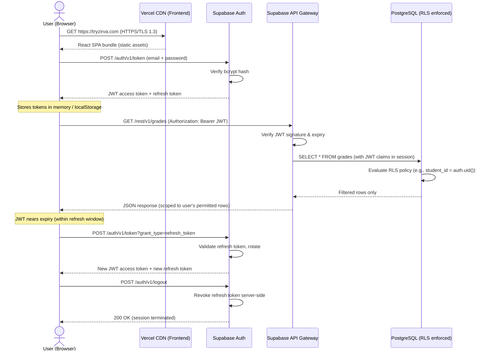

# Security Architecture
## Zirva School Management Platform — tryzirva.com

**Submitted in response to letter № VM26005443 dated 24 April 2026 from the Ministry of Science and Education of the Republic of Azerbaijan.**

| Field | Detail |
|---|---|
| Document Reference | ZRV-SEC-002 |
| Version | 1.0 |
| Date | 28 April 2026 |
| Prepared by | Kaan Guluzada, Founder & CEO |
| Platform | Zirva — tryzirva.com |
| Contact | hello@tryzirva.com · +994 50 241 14 42 · +994 90 110 66 00 |

---

## Executive Summary

Zirva is a cloud-based school management platform that serves five distinct user roles: Teacher, Student, Parent, School Administrator, and Ministry Official. Security is implemented in depth across every layer of the stack. Authentication is handled by Supabase Auth, which issues short-lived JSON Web Tokens (JWT) and enforces email/password or magic-link login flows. Authorization is enforced at the database layer through Supabase Row Level Security (RLS) policies, ensuring that no user — regardless of client-side behaviour — can read or write data outside their permitted scope. All data in transit is protected by TLS 1.2/1.3 enforced by both Vercel (frontend CDN) and Supabase (database and API layer). All data at rest is encrypted using AES-256 by Supabase's managed PostgreSQL infrastructure, which operates under SOC 2 Type II certification. There is no standalone backend server: business logic is executed within Supabase Edge Functions and RLS policies, which reduces the attack surface significantly. Secrets are stored exclusively in Vercel environment variables and are never bundled into the client-side application. Error monitoring is provided by Sentry, and a formal penetration test is planned prior to full national rollout. This document describes the complete security architecture in detail and identifies open items for which Ministry guidance is respectfully requested.

---

## 1. Authentication

### 1.1 Overview

Zirva uses **Supabase Auth** as its identity provider. Supabase Auth is an open-source authentication service built on top of GoTrue, a battle-tested authentication server. All authentication state is managed server-side; the client receives only a signed JWT and a refresh token.

### 1.2 Supported Authentication Methods

| Method | Status | Notes |
|---|---|---|
| Email / Password | Live | Passwords hashed with bcrypt |
| Magic Link (passwordless email) | Live | One-time link, 60-minute expiry |
| OAuth (Google, Microsoft) | Planned | Pending school IT policy assessment |
| SAML / SSO | [FILL IN: under evaluation] | For district-level integration |

### 1.3 Password Policy

- Minimum length: 8 characters (to be increased to 12 before full rollout).
- Passwords are hashed using **bcrypt** with a work factor of 10 before storage. Plaintext passwords are never stored or logged.
- Password reset flows are delivered via a time-limited email link (default expiry: 60 minutes).

### 1.4 Magic Link Flow

When a user requests a magic link, Supabase Auth:

1. Generates a cryptographically random one-time token.
2. Stores a hashed version of that token in the database with a 60-minute TTL.
3. Delivers the raw token to the user's registered email address as a URL.
4. On click, verifies the token against the stored hash, issues a JWT session, and immediately invalidates the token.

Magic links are single-use. Reuse of an expired or already-consumed link results in an error with no session issued.

### 1.5 JWT Token Structure

On successful authentication, Supabase Auth issues two tokens:

- **Access Token (JWT)**: A signed RS256 JWT containing `sub` (user UUID), `role` (Supabase database role), `email`, and `exp` (expiry). Default access token lifetime is **3600 seconds (1 hour)**.
- **Refresh Token**: An opaque, high-entropy random string stored server-side. Default lifetime is **7 days** with rotation on use.

The JWT is verified on every API request by Supabase's API gateway before any database query is executed. A request with an expired, malformed, or tampered JWT is rejected with HTTP 401 before reaching the database layer.

### 1.6 Session Lifecycle and Token Refresh

The Supabase client library (supabase-js) automatically detects when an access token is within its refresh window and silently exchanges the refresh token for a new access token and a new refresh token (rotation). This rotation ensures that a stolen refresh token becomes invalid once the legitimate client uses it. The sequence is:

1. User authenticates → access token + refresh token issued.
2. Access token expires → supabase-js calls `/auth/v1/token?grant_type=refresh_token`.
3. Server validates refresh token, issues new pair, invalidates old refresh token.
4. If the refresh token is expired or already used, the user is signed out.

### 1.7 Logout Behaviour

On explicit logout, the Supabase Auth API revokes the refresh token server-side. The client clears the session from localStorage. Any subsequent attempt to use the revoked refresh token returns HTTP 400 and no new session is issued. Access tokens issued before logout remain cryptographically valid until their natural expiry (up to 1 hour); this is a known limitation of stateless JWTs and is mitigated by keeping the access token lifetime short.

---

## 2. Multi-Factor Authentication (MFA)

**Current status: MFA is not yet implemented in the production environment.**

Supabase Auth supports TOTP-based MFA (Time-based One-Time Password, compatible with Google Authenticator, Authy, and similar applications). Implementation is planned for the pilot phase before broad rollout.

Planned MFA policy:
- **Ministry Officials**: MFA will be mandatory.
- **School Administrators**: MFA will be mandatory.
- **Teachers**: MFA strongly recommended; enforcement timeline to be confirmed with pilot schools.
- **Parents and Students**: MFA optional, opt-in.

[FILL IN: Ministry guidance requested on whether mandatory MFA for all roles is required under national education data-handling policy.]

---

## 3. Authorization and Role-Based Access Control (RBAC)

### 3.1 Role Model

Zirva defines five application-level roles:

| Role ID | Role Name | Description |
|---|---|---|
| `teacher` | Teacher | Accesses classes, grades, attendance for their own assigned classes only |
| `student` | Student | Accesses their own grades, schedule, and assignments only |
| `parent` | Parent | Accesses data for their own linked child(ren) only |
| `school_admin` | School Administrator | Full access within their own school; no cross-school access |
| `ministry` | Ministry Official | Aggregate and statistical views across all schools; no individual student PII without school approval |

Roles are stored in the `user_profiles` table in the Supabase database and are embedded in the JWT claim on login.

### 3.2 What is Row Level Security (RLS)?

Row Level Security is a PostgreSQL feature that attaches a security policy directly to a database table. When RLS is enabled on a table, every query — regardless of how it is formed by the application — is automatically filtered by the applicable policy for the authenticated user. The policy is evaluated inside the database engine; it cannot be bypassed by the application layer, by a network proxy, or by a malicious client sending a crafted request.

The Supabase API gateway passes the authenticated user's JWT to the PostgreSQL session via `request.jwt.claims`. RLS policies can then reference these claims to restrict rows.

### 3.3 Example RLS Policies by Role

**Teacher — can only read grades for students in their own classes:**

```sql
CREATE POLICY "teachers_see_own_class_grades"
ON grades
FOR SELECT
USING (
  class_id IN (
    SELECT class_id FROM class_teachers
    WHERE teacher_id = auth.uid()
  )
);
```

**Student — can only read their own grades:**

```sql
CREATE POLICY "students_see_own_grades"
ON grades
FOR SELECT
USING (student_id = auth.uid());
```

**Parent — can only read data for their linked children:**

```sql
CREATE POLICY "parents_see_linked_children_grades"
ON grades
FOR SELECT
USING (
  student_id IN (
    SELECT child_id FROM parent_child_links
    WHERE parent_id = auth.uid()
  )
);
```

**School Administrator — full access within their own school:**

```sql
CREATE POLICY "school_admins_own_school"
ON grades
FOR ALL
USING (
  school_id = (
    SELECT school_id FROM user_profiles
    WHERE id = auth.uid()
  )
);
```

**Ministry Official — aggregate views only; individual student PII gated by school approval:**

```sql
CREATE POLICY "ministry_aggregate_access"
ON grades
FOR SELECT
USING (
  (SELECT role FROM user_profiles WHERE id = auth.uid()) = 'ministry'
  AND EXISTS (
    SELECT 1 FROM school_ministry_consents
    WHERE school_id = grades.school_id
    AND consent_granted = TRUE
  )
);
```

Ministry officials can access aggregated statistical data (average scores by school, attendance rates, pass/fail distributions) without triggering individual student PII access. Drill-down to individual student records requires explicit consent recorded in the `school_ministry_consents` table.

### 3.4 Role-Permission Matrix

| Permission | Teacher | Student | Parent | School Admin | Ministry |
|---|---|---|---|---|---|
| View own grades | - | Yes | - | - | - |
| View child's grades | - | - | Yes | - | - |
| View class grades (own classes) | Yes | - | - | - | - |
| View all school grades | - | - | - | Yes | - |
| View aggregate school statistics | - | - | - | Yes | Yes |
| View individual student PII | Own class only | Own only | Own child only | Own school | With consent |
| Edit grades | Own classes | No | No | Override only | No |
| Manage users (school) | No | No | No | Yes | No |
| Manage schools | No | No | No | No | Yes |
| Export data | Limited | No | No | Own school | Aggregate |
| View audit logs | No | No | No | Own school | All schools |

---

## 4. Session Management

### 4.1 Token Expiry Configuration

| Token Type | Default Lifetime | Configurable |
|---|---|---|
| JWT Access Token | 3600 seconds (1 hour) | Yes, via Supabase Auth settings |
| Refresh Token | 7 days | Yes, via Supabase Auth settings |
| Magic Link | 3600 seconds (1 hour) | Yes |
| Password Reset Link | 3600 seconds (1 hour) | Yes |

### 4.2 Concurrent Session Handling

Supabase Auth permits multiple concurrent sessions per user (e.g., the same teacher logged in on a laptop and a mobile device). Each device holds its own refresh token. Revoking one session does not revoke others. [FILL IN: A policy on maximum concurrent sessions per role is under review. Ministry guidance on whether single-session-only enforcement is required for Ministry Official accounts would be welcomed.]

### 4.3 Inactivity Timeout

Client-side inactivity timeout is [FILL IN: planned — specific idle timeout value pending UX and policy review]. The server-side access token TTL (1 hour) provides a floor on re-authentication frequency.

---

## 5. API Security

### 5.1 Supabase API Key Architecture

Supabase exposes two API key types:

| Key Type | Scope | Where Used |
|---|---|---|
| `anon` key | Public, RLS-scoped | Embedded in frontend (safe by design — RLS enforces all access rules) |
| `service_role` key | Bypasses RLS entirely | Server-side only — Supabase Edge Functions or admin scripts; **never in client bundle** |

The `anon` key is intentionally public. Its permissions are restricted entirely by RLS policies. A user who extracts the `anon` key from the client application gains nothing beyond what the RLS policies permit for the `anon` role, which by default is no access to any table.

The `service_role` key is stored exclusively in Vercel environment variables (server-side, encrypted at rest, not exposed to the browser). It is used only within Supabase Edge Functions for administrative operations such as user provisioning.

### 5.2 API Rate Limiting

Supabase applies rate limiting on authentication endpoints by default (configurable). Vercel applies DDoS protection and rate limiting at the CDN edge. [FILL IN: Application-level rate limiting per endpoint is planned for the production hardening phase.]

### 5.3 CORS Policy

CORS (Cross-Origin Resource Sharing) is configured on the Supabase project to allow requests only from `https://tryzirva.com` and `https://www.tryzirva.com`. Requests from other origins are rejected at the API gateway before reaching the database.

---

## 6. Infrastructure Security

### 6.1 Frontend Hosting — Vercel

The Zirva frontend (React 18 / Vite 5 single-page application) is deployed on **Vercel**. Relevant security properties:

- Vercel holds **SOC 2 Type II** certification.
- Static assets are distributed via Vercel's global CDN (primary region: iad1, US East; European edge nodes serve European users with reduced latency).
- Environment variables are encrypted at rest and are never included in the compiled client bundle.
- Automatic HTTPS with HSTS (HTTP Strict Transport Security) is enforced for all deployments.
- Preview deployments are protected by Vercel authentication and are not publicly accessible.

### 6.2 Database and API — Supabase

The Zirva database is hosted on **Supabase**, running on AWS infrastructure in the **ap-northeast-2 region (Seoul, South Korea)**.

- Supabase holds **SOC 2 Type II** certification.
- The underlying AWS infrastructure (EC2, RDS) is protected by AWS's physical and network security controls, which are covered by AWS's own SOC 2, ISO 27001, and PCI DSS certifications.
- Database access from the public internet is restricted to the Supabase API gateway (PostgREST); direct PostgreSQL port access is not exposed.
- Supabase manages OS patching, database version updates, and infrastructure vulnerability remediation.

### 6.3 Data Residency

[FILL IN: The current database region is ap-northeast-2 (Seoul, South Korea). If Azerbaijani data residency requirements mandate storage within the Republic of Azerbaijan or within specific approved jurisdictions, Supabase's infrastructure options and potential migration path will need to be assessed. Ministry guidance on data residency requirements is respectfully requested.]

---

## 7. Transport Encryption

All data transmitted between clients and the Zirva platform is encrypted in transit. This applies to all API calls, authentication flows, file uploads, and page loads.

| Layer | Protocol | Enforced By |
|---|---|---|
| Browser → Vercel CDN (frontend) | TLS 1.2 / TLS 1.3 | Vercel (automatic, no plaintext fallback) |
| Browser → Supabase API | TLS 1.2 / TLS 1.3 | Supabase API gateway |
| Supabase API → PostgreSQL | Encrypted internal channel | Supabase managed infrastructure |
| Edge Function → External APIs | TLS 1.2 / TLS 1.3 | Enforced per outbound call |

HTTP (plaintext) requests to `tryzirva.com` are automatically redirected to HTTPS with a 301 permanent redirect. HSTS headers with `max-age=31536000` instruct browsers to enforce HTTPS for all future requests, preventing SSL stripping attacks.

TLS 1.0 and TLS 1.1 are not supported. TLS 1.3, which provides perfect forward secrecy by default on all cipher suites, is preferred where supported by the client.

---

## 8. Encryption at Rest

All data stored in Supabase (PostgreSQL) is encrypted at rest using **AES-256**, applied transparently at the storage layer by AWS. This includes:

- All database tables (user profiles, grades, attendance records, class data).
- Database backups and snapshots.
- Transaction logs.

Encryption key management is handled by AWS KMS (Key Management Service) under Supabase's managed infrastructure. [FILL IN: Customer-managed encryption keys (BYOK) are under evaluation for the Ministry Official tier if required by national security policy.]

Static assets (JavaScript bundles, images) hosted on Vercel CDN are also stored on encrypted underlying storage (AWS S3 and equivalent).

---

## 9. Secrets Management

Secrets — including the Supabase `service_role` key, Anthropic Claude API key, and Sentry DSN — are managed as follows:

| Secret | Storage Location | Accessible From |
|---|---|---|
| Supabase `anon` key | Vercel environment variable (public, by design) | Client bundle (safe — scoped by RLS) |
| Supabase `service_role` key | Vercel environment variable (server-only) | Edge Functions only — never client |
| Anthropic Claude API key | Vercel environment variable (server-only) | Edge Functions only |
| Sentry DSN | Vercel environment variable | Client bundle (DSN is non-sensitive by Sentry design) |
| Database connection string | Supabase managed (not exposed to application) | Internal Supabase infrastructure only |

Vercel environment variables designated as server-only are excluded from the Vite build at compile time. The production client bundle is regularly inspected to confirm no service-role keys or other server secrets are present. [FILL IN: A formal secret scanning CI step is planned for the pre-rollout hardening phase.]

---

## 10. Audit Logging

### 10.1 What Is Logged

Zirva maintains audit logs for the following event categories:

| Event Category | Events Logged | Storage |
|---|---|---|
| Authentication | Login (success/failure), logout, magic link request, password reset | Supabase Auth logs |
| Role changes | Role assignment, role modification, user deactivation | Application audit table |
| Grade modifications | Grade creation, update, deletion (with before/after values) | Application audit table |
| Data exports | Export initiated by whom, data scope, timestamp | Application audit table |
| Administrative actions | User creation, school configuration changes | Application audit table |
| API errors | 4xx/5xx errors, rate limit hits | Sentry |

### 10.2 Audit Table Structure

Each audit record captures: `event_id`, `event_type`, `actor_user_id`, `actor_role`, `target_entity_type`, `target_entity_id`, `school_id`, `before_value` (JSON), `after_value` (JSON), `ip_address`, `user_agent`, `timestamp`.

### 10.3 Log Retention

[FILL IN: Log retention policy is currently set to 90 days. Ministry guidance on required retention duration (e.g., per national records management law) is requested. Logs can be exported to long-term cold storage if retention beyond 90 days is required.]

### 10.4 Log Access

- School Administrators can view audit logs scoped to their own school.
- Ministry Officials can view aggregate audit reports across all schools.
- Raw log access is restricted to the platform owner (Kaan Guluzada) for incident investigation.

---

## 11. Threat Model

The following table identifies the top eight threats to the Zirva platform, their assessed likelihood and impact, and the mitigations in place or planned.

| # | Threat | Likelihood | Impact | Mitigation |
|---|---|---|---|---|
| 1 | **Credential stuffing / brute-force login** | High | High | Supabase Auth rate limiting on `/auth/v1/token`; bcrypt hashing; planned MFA for privileged roles |
| 2 | **JWT token theft (XSS)** | Medium | High | React's DOM escaping mitigates XSS; `HttpOnly` cookie option under evaluation; short (1-hour) JWT TTL limits exposure window |
| 3 | **Unauthorized cross-school data access** | Low | Critical | Supabase RLS policies enforced at DB layer; no application-layer bypass possible; policies tested per-role |
| 4 | **Service-role key exfiltration** | Low | Critical | Key never in client bundle; stored in Vercel server-only env vars; access restricted to Edge Functions |
| 5 | **Supabase/Vercel supply-chain compromise** | Very Low | Critical | Both providers SOC 2 Type II certified; dependency pinning; monitoring via Sentry |
| 6 | **Insider threat (platform admin)** | Low | High | Audit logging of all admin actions; RLS limits even admin access to intended scope; [FILL IN: access review process planned] |
| 7 | **Man-in-the-middle / SSL stripping** | Very Low | High | HSTS enforced; TLS 1.2/1.3 only; TLS 1.0/1.1 disabled |
| 8 | **AI prompt injection via Claude API** | Low | Medium | Claude API calls are server-side only (Edge Functions); user input is sanitised before inclusion in prompts; responses are validated before display |

---

## 12. Incident Response Plan

The following plan governs the response to a confirmed or suspected security incident affecting Zirva.

### 12.1 Detection

- **Sentry** alerts on elevated error rates, unusual exception patterns, or authentication failures.
- **Supabase Auth logs** and **application audit tables** are reviewed periodically and on alert.
- External reports from users, school administrators, or Ministry officials are accepted via hello@tryzirva.com and treated as potential incidents from receipt.

### 12.2 Triage (within 1 hour of detection)

1. Confirm the incident is genuine (rule out false positives, testing activity).
2. Classify severity: Critical (data breach, unauthorized PII access), High (service disruption, suspected credential compromise), Medium (isolated error, no data exposure), Low (informational).
3. Assign incident owner (currently: Kaan Guluzada, Founder & CEO).

### 12.3 Containment (within 2 hours for Critical/High)

- Revoke affected user sessions via Supabase Auth admin API.
- Rotate compromised credentials or API keys via Vercel and Supabase dashboards.
- If necessary, enable Supabase maintenance mode to halt all public API access.
- Preserve logs and snapshots before any remediation changes.

### 12.4 Notification

| Stakeholder | Notification Timeline | Channel |
|---|---|---|
| Affected school administrators | Within 24 hours of confirmed breach | Email + in-platform notification |
| Ministry of Science and Education | Within 72 hours of confirmed personal data breach | Formal written notification [FILL IN: address/portal TBD per Ministry guidance] |
| Affected individual users | [FILL IN: timeline per applicable data protection law] | Email |

[FILL IN: Azerbaijan's Law on Personal Data (2010) notification requirements should be reviewed with legal counsel to confirm timelines.]

### 12.5 Remediation

1. Apply fix to the vulnerability (code patch, configuration change, credential rotation).
2. Deploy to production via Vercel CI/CD pipeline.
3. Verify fix via targeted testing.
4. Re-enable full service access.

### 12.6 Post-Mortem (within 5 business days)

A written post-mortem is prepared for every Critical or High severity incident. It includes: timeline, root cause, impact assessment, remediation taken, and preventive measures. Post-mortem reports are made available to the Ministry on request.

---

## 13. Security Testing

### 13.1 Current Approach

| Testing Method | Status |
|---|---|
| Manual code review of RLS policies | Ongoing |
| Manual testing of role boundaries | Ongoing during feature development |
| Sentry real-time error monitoring | Live |
| Dependency vulnerability scanning (`npm audit`) | [FILL IN: to be integrated into CI pipeline] |

### 13.2 Planned Before Full Rollout

| Activity | Target Timeline |
|---|---|
| Independent penetration test (web application) | [FILL IN: prior to national rollout — estimated Q3 2026] |
| Automated DAST (dynamic application security testing) | [FILL IN: Q3 2026] |
| Formal code audit of all RLS policies by a PostgreSQL security specialist | [FILL IN: Q2/Q3 2026] |
| Bug bounty programme | [FILL IN: under evaluation] |

[FILL IN: Ministry guidance on whether an independently certified penetration test report is required as a condition of national deployment would be helpful for scheduling.]

---

## 14. Authentication Flow — Diagram

The following Mermaid diagram illustrates the end-to-end authentication and authorized data access flow for a standard user session.



---

## 15. Next Steps / Requested Decisions

The following items require input or decisions from the Ministry of Science and Education before Zirva can finalize its compliance posture:

| # | Item | Details | Ministry Action Requested |
|---|---|---|---|
| 1 | **Data Residency** | Database is currently in AWS ap-northeast-2 (Seoul). Does the Ministry require data storage within Azerbaijan or within an approved jurisdiction? | Confirm approved data residency regions |
| 2 | **MFA Enforcement Policy** | MFA is planned but not yet implemented. Which roles must have mandatory MFA? | Confirm mandatory-MFA role requirements |
| 3 | **Log Retention Duration** | Current default: 90 days. What is the nationally required retention period for educational platform audit logs? | Specify required log retention period |
| 4 | **Breach Notification Protocol** | Formal notification channel and deadline for personal data breach notification to the Ministry. | Provide official incident notification channel and contact |
| 5 | **Penetration Test Certification** | Is an independently certified penetration test report a formal requirement for national deployment approval? | Confirm and specify certification standards if applicable |
| 6 | **Single-Session Enforcement** | Is single-session-only login required for Ministry Official accounts? | Confirm session concurrency requirements |
| 7 | **Data Protection Law Alignment** | Confirmation of applicable personal data laws and any sector-specific education data handling requirements under Azerbaijani law. | Provide or reference applicable legal framework |

---

## Contact

**Kaan Guluzada**
Founder & CEO, Zirva
tryzirva.com
hello@tryzirva.com
+994 50 241 14 42
+994 90 110 66 00

*This document is submitted in good faith as a technical disclosure in response to letter № VM26005443 (24.04.2026). All [FILL IN: ...] markers indicate items for which additional information or Ministry guidance is needed and will be updated upon receipt of that guidance.*
