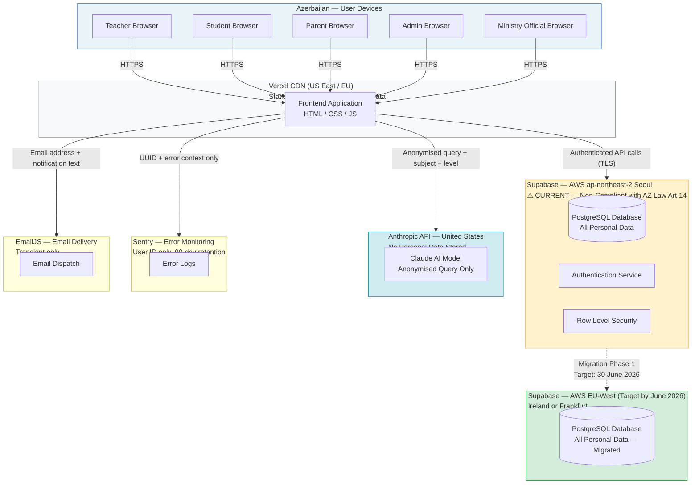

# Data Protection Mechanisms — Zirva School Management Platform

**Submitted in response to letter № VM26005443 dated 24 April 2026 from the Ministry of Science and Education of the Republic of Azerbaijan.**

**Submitted by:** Kaan Guluzada, Founder & CEO, Zirva
**Contact:** hello@tryzirva.com | +994 50 241 14 42 | +994 90 110 66 00
**Platform URL:** https://tryzirva.com
**Date of Submission:** 28 April 2026

---

## Executive Summary

Zirva is a school management platform designed to serve teachers, students, parents, school administrators, and Ministry officials within the Azerbaijani education system. This document sets out the full data protection framework governing the platform, submitted in direct response to the Ministry's inquiry referenced above. The platform currently stores its primary database on Supabase infrastructure hosted in the AWS ap-northeast-2 region (Seoul, Republic of Korea). Zirva acknowledges, without reservation, that this configuration does not satisfy the data residency requirements arising under the Law of the Republic of Azerbaijan "On Personal Data" (18.03.1998, №461-IQ and subsequent amendments), given the absence of a bilateral data protection agreement between Azerbaijan and the Republic of Korea. This gap is known, is treated as a priority compliance issue, and a concrete remediation plan — including migration to EU-West infrastructure as an interim step and evaluation of Azerbaijan-local hosting as a condition of Ministry adoption — is detailed in Section 3 of this document. All other elements of the data protection framework described herein are currently in force. Zirva respectfully requests that the Ministry review the remediation timeline and provide guidance on the preferred hosting outcome.

---

## 1. Legal Framework and Compliance Mapping

### 1.1 Applicable Azerbaijani Legislation

The primary legal instrument governing personal data processing in the Republic of Azerbaijan is the Law "On Personal Data" (18.03.1998, №461-IQ), as amended. The following articles are of direct relevance to the Zirva platform's operations:

- **Article 1 (Definitions):** Establishes the definitions of "personal data," "subject of personal data," "operator," and "processing." Zirva acts as an operator of personal data in relation to all user categories on its platform.
- **Article 6 (Principles of personal data processing):** Requires that processing be lawful, fair, limited to declared purposes, and that data be accurate and not retained longer than necessary. Zirva's processing is grounded in the educational service agreement entered into by each school and is limited to the purposes described in Section 4 below.
- **Article 8 (Consent):** Requires the consent of the data subject, or a lawful representative, prior to processing. For student users who are minors (under 18 years of age), parental or guardian consent is obtained at the point of registration. The consent workflow is described in Section 7.
- **Article 10 (Special categories of data):** Places heightened obligations on processing of sensitive data categories. Zirva does not collect health, biometric, or financial data beyond what is strictly necessary for the academic record.
- **Article 14 (Cross-border transfer):** Permits transfer of personal data to foreign states that provide adequate protection of personal data rights, or subject to the consent of the data subject. The current hosting arrangement in the Republic of Korea does not satisfy the adequacy standard under this article. This issue is addressed directly in Section 3.
- **Article 16 (Rights of data subjects):** Enumerates data subject rights including access, correction, deletion, and objection. These are operationalised within Zirva as described in Section 8.
- **Article 19 (Security obligations):** Requires operators to implement technical and organisational measures to protect personal data against unauthorised access, destruction, or alteration. Zirva's security measures are described in Section 5 and throughout this document.

### 1.2 Other Applicable Frameworks

In addition to the national law, Zirva has regard for the following regulatory considerations:

- **Ministry of Science and Education regulations** governing educational records, student data, and grade retention requirements applicable to Azerbaijani schools.
- **Child protection obligations** applicable to the processing of data belonging to minors, including the requirement for explicit parental consent and the principle of data minimisation when processing children's personal information.
- **Contractual obligations** under Data Processing Agreements with third-party infrastructure and service providers (Supabase, Anthropic), which are described in Section 10.

---

## 2. Personal Data Collected — Categories, Purposes, and Retention

The following table sets out each category of personal data processed by Zirva, the user group to whom it belongs, the purpose for which it is collected, and the applicable retention period.

| Data Type | Data Subject | Purpose | Retention Period |
|---|---|---|---|
| Full name | Student, Teacher, Parent, Administrator | Account identification, communication | Duration of active account + 2 years post-closure |
| Date of birth | Student | Age verification, minor status determination, grade placement | Duration of enrollment + 2 years |
| Government ID number (FIN) | Student (optional), Teacher | Identity verification for official records where required | Duration of relationship + 2 years |
| School name and class | Student | Curriculum context, class assignment, grade records | Duration of enrollment + 2 years |
| Email address | All roles | Account login, notifications, password recovery | Duration of active account + 2 years |
| Phone number | Parent, Administrator | Emergency contact, two-factor authentication | Duration of active account + 2 years |
| Profile photograph | Teacher, Student (optional) | Account display, identification within school context | Until deleted by user or account closure |
| Academic grades and assessments | Student | Academic record, progress tracking, Ministry reporting | Permanent academic record (per educational record retention obligations) |
| Attendance records | Student | Compliance reporting, parent notification | Duration of enrollment + 5 years |
| Assignment submissions | Student | Assessment, academic progress | Duration of enrollment + 2 years |
| AI interaction session text | Student | AI-assisted learning responses | 30 days, then permanently deleted |
| System access logs | All roles | Security auditing, fraud prevention | 90 days, then permanently deleted |
| Error and diagnostic logs | All roles (user ID only) | Platform stability and bug resolution | 90 days |
| Communication records (messages sent via platform) | All roles | Audit trail for school-parent-teacher communication | Duration of enrollment + 2 years |

### 2.1 Data Minimisation

Zirva operates under a strict data minimisation principle: each feature of the platform is designed to collect only the minimum data necessary for its stated function. Examples of this principle in practice:

- The AI tutoring feature receives only the student's query text, the subject area, and the curriculum level. It does not receive the student's name, identification number, school name, or any parent information.
- The parent notification system uses email addresses already provided at registration; no additional contact data is solicited.
- Attendance tracking records present/absent status per student per day; it does not record location, health reason, or biometric data.
- Ministry-level dashboards display aggregate, anonymised statistics by default; individual student or teacher records are not surfaced without a formal request process (see Section 13).

---

## 3. Data Residency — Current State, Legal Assessment, and Remediation Plan

### 3.1 Current State

Zirva's primary database is hosted on Supabase, a managed PostgreSQL infrastructure provider. The database instance is currently provisioned in the **AWS ap-northeast-2 region, located in Seoul, Republic of Korea**. This region was selected during the initial product build as the default nearest region offered by Supabase at the time of setup, without full consideration of Azerbaijani data residency obligations.

All structured personal data described in Section 2 — including student records, teacher profiles, parent contact details, grades, attendance, and assignment data — resides in this Seoul instance.

### 3.2 Legal Assessment

Article 14 of Law №461-IQ permits cross-border transfer of personal data only to states providing an adequate level of protection, or with the express consent of the data subject. The Republic of Korea does not have a bilateral data protection agreement with the Republic of Azerbaijan, and no adequacy determination has been made. Reliance on individual consent is not a sustainable long-term compliance mechanism for an institutional platform of this nature.

Zirva acknowledges that the current configuration represents a material non-compliance with Article 14 and is committed to full remediation prior to any formal adoption or certification by the Ministry.

### 3.3 Interim Mitigations Currently in Place

While the migration described below is being executed, the following interim mitigations reduce risk:

- All data is encrypted at rest using AES-256 encryption within the Supabase infrastructure.
- All data in transit is protected by TLS 1.2 or higher.
- Access to the database is restricted to authenticated application services only; no public access is enabled.
- A Data Processing Agreement (DPA) is in place with Supabase, defining Supabase's role as a data processor and specifying obligations around security, confidentiality, and sub-processor management.
- No personal data is retained beyond the periods specified in Section 2.

### 3.4 Remediation Plan

Zirva has established the following remediation roadmap:

| Phase | Action | Target Completion |
|---|---|---|
| Phase 1 | Migrate Supabase database instance from AWS ap-northeast-2 (Seoul) to AWS eu-west-1 (Ireland) or eu-central-1 (Frankfurt) | 30 June 2026 |
| Phase 2 | Conduct technical assessment of Azerbaijan-local hosting options, including evaluation of local cloud providers and colocation facilities | 31 August 2026 |
| Phase 3 | Confirm preferred hosting destination in consultation with the Ministry and begin migration to Azerbaijan-local or Ministry-approved infrastructure | Subject to Ministry guidance; target Q4 2026 |
| Phase 4 | Full compliance with Article 14 upon completion of Phase 3 | Q4 2026 |

The EU-West migration in Phase 1 does not achieve full compliance with Article 14 but meaningfully reduces risk by moving data to a jurisdiction with a comprehensive data protection legal framework (GDPR), encrypted at rest and in transit, with established sub-processor controls. Phase 3 is contingent on Ministry guidance regarding the preferred or required hosting outcome, which is one of the specific decisions Zirva requests in Section 14 of this document.

---

## 4. Data Minimisation Principles

Zirva's product development process incorporates the following data minimisation controls:

1. **Feature-level data scoping:** Each product feature is reviewed during design to determine the minimum data set required for its function. No additional fields are added speculatively.
2. **Role-based data visibility:** Each user role has access only to the data relevant to their function. A teacher sees the students in their assigned classes. A parent sees only their own child's records. A Ministry official sees aggregate dashboards; individual records require a formal access request.
3. **No advertising or analytics profiling:** Zirva does not use personal data for advertising, behavioural profiling, or any purpose beyond the direct delivery of educational services to the school.
4. **Pseudonymisation in logs:** System and error logs reference internal user IDs rather than names, email addresses, or other directly identifying information.
5. **AI prompt stripping:** Before any student query is submitted to the Anthropic API, the application layer strips all identifying fields, as detailed in Section 10.

---

## 5. Retention Policies

| Data Category | Retention Period | Justification |
|---|---|---|
| Student academic records (grades, assessments) | Permanent | Educational record retention obligations; required for certification verification |
| Student enrollment data (name, class, DOB) | Duration of enrollment + 2 years | Allows post-enrollment queries and corrections |
| Attendance records | Duration of enrollment + 5 years | Regulatory compliance and potential dispute resolution |
| Assignment submissions | Duration of enrollment + 2 years | Academic record integrity |
| Teacher and administrator profiles | Duration of employment relationship + 2 years | HR record requirements |
| Parent contact data | Duration of child's enrollment + 2 years | Communication continuity |
| AI tutoring session text | 30 days | Minimum necessary for session quality; not part of permanent academic record |
| System access logs | 90 days | Security audit purposes |
| Error and diagnostic logs | 90 days | Platform stability |
| Deleted account data | 30 days in recoverable state, then purged | Accidental deletion recovery window |

Data reaching end of retention period is subject to automated deletion routines that execute monthly. Records subject to a pending legal hold, formal complaint, or Ministry investigation are exempt from automated deletion until the matter is resolved.

---

## 6. Security Measures

### 6.1 Technical Controls

- **Encryption at rest:** AES-256 encryption applied to all data stored in the Supabase PostgreSQL database.
- **Encryption in transit:** TLS 1.2 minimum across all platform endpoints; TLS 1.3 enforced where supported.
- **Authentication:** Email-and-password authentication with hashed credentials (bcrypt). Multi-factor authentication is available and recommended for administrator and Ministry-level accounts.
- **Row-level security (RLS):** Supabase Row Level Security policies ensure that database queries return only records belonging to the authenticated user's school, class, or role scope.
- **API key management:** All third-party API keys are stored as environment variables in the deployment environment; they are never exposed to the client side.
- **Dependency management:** Regular automated scanning for vulnerable dependencies using GitHub Dependabot.

### 6.2 Organisational Controls

- Access to production infrastructure is limited to two named individuals (founders) during the current stage of operations.
- All access is logged and reviewable.
- Staff handling personal data are briefed on data protection obligations.
- Any new infrastructure provider is assessed against data protection requirements before onboarding.

---

## 7. Parental Consent for Student Data (Minors Under 18)

### 7.1 Consent Requirement

All student users of the Zirva platform who are under 18 years of age at the time of registration are treated as minor data subjects. Processing of a minor's personal data requires the verifiable consent of a parent or legal guardian, in accordance with Article 8 of Law №461-IQ.

### 7.2 Consent Workflow

1. When a school administrator creates a student account, the platform prompts for the parent's or guardian's email address.
2. An automated email is sent to the parent containing a consent notice that clearly describes: (a) the categories of data to be collected; (b) the purposes for which it will be used; (c) the third-party processors involved; (d) the rights of the parent and child; and (e) the contact details for the data controller.
3. The parent must click a confirmation link and acknowledge the consent notice before the student account is activated.
4. A timestamped record of consent is stored and associated with the student's account for the duration of their enrollment.
5. Consent may be withdrawn at any time by the parent via written request to hello@tryzirva.com, subject to the retention obligations described in Section 5 (certain academic records cannot be deleted even on withdrawal of consent, as they form part of the official educational record).

### 7.3 What Parents Can Access

Parents with active accounts can:

- View their child's grades, attendance records, and assignment submissions.
- View teacher feedback and communications addressed to the parent.
- Request a full export of their child's data in CSV or PDF format.
- Request correction of factually inaccurate data.
- Request deletion of non-mandatory data (see Section 8 for academic record exceptions).

---

## 8. Data Subject Rights

In accordance with Article 16 of Law №461-IQ, Zirva provides the following rights to all data subjects, exercisable by submitting a written request to hello@tryzirva.com or via the in-platform account settings:

### 8.1 Right to Access
Any data subject may request a copy of all personal data held about them. Requests will be acknowledged within 5 business days and fulfilled within 30 calendar days.

### 8.2 Right to Correction
Any data subject may request correction of inaccurate or incomplete personal data. Corrections to academic records (grades, assessments) require validation by the school administrator or teacher of record before being applied, to maintain academic integrity.

### 8.3 Right to Deletion
Any data subject may request deletion of their personal data. Zirva will comply subject to the following exceptions:
- Academic records (grades, assessments, attendance) that form part of the official educational record are retained in accordance with educational record retention laws and cannot be deleted on the basis of an individual request alone.
- Data subject to an active legal hold or investigation is exempt until resolution.
- Data required for the performance of an ongoing contractual obligation (e.g., a student currently enrolled) will be retained for the duration of that obligation.

### 8.4 Right to Data Portability
Data subjects may request export of their personal data in a structured, machine-readable format (CSV). Schools may request export of all data associated with their institution in bulk. This is described further in Section 12.

### 8.5 Right to Objection
Data subjects may object to processing carried out on the basis of legitimate interest. Objections will be assessed on a case-by-case basis within 30 days.

### 8.6 Exercising Rights for Minor Data Subjects
For students under 18, rights may be exercised by the parent or legal guardian on their behalf. Requests from the student themselves will be accepted where the student is 16 years or older and the request does not concern deletion of official academic records.

---

## 9. Breach Notification Procedure

In the event of a personal data breach, Zirva will follow the procedure below:

| Step | Timeline | Action |
|---|---|---|
| Detection | T+0 | Breach detected via monitoring alerts (Sentry), infrastructure notifications, or internal report |
| Initial Assessment | T+0 to T+24 hours | Severity assessment: scope of data affected, number of data subjects, nature of data, likely consequences |
| Containment | T+0 to T+24 hours | Immediate containment measures: revoke compromised credentials, isolate affected systems, preserve audit logs |
| Internal Report | T+72 hours | Full internal incident report completed, including root cause analysis and preliminary remediation steps |
| Authority Notification | T+72 hours | Notification to the relevant supervisory authority (including the Ministry, as applicable) if the breach poses a risk to data subjects' rights |
| Affected User Notification | Within 7 days of determining data subject identity | Individual notification to affected data subjects where the breach is likely to result in high risk |
| Post-Incident Review | Within 30 days | Root cause analysis, implementation of corrective measures, update to security controls |

Notifications to authorities will include: the nature of the breach, the categories and approximate number of data subjects and records affected, likely consequences of the breach, and the measures taken or proposed to address it.

---

## 10. Third-Party Data Sharing

### 10.1 Anthropic API (AI Feature)

The AI-assisted learning feature submits student queries to the Anthropic Claude API for processing.

**What IS sent to Anthropic:**
- The student's query text (e.g., "Can you explain photosynthesis?")
- The subject area (e.g., "Biology")
- The curriculum level (e.g., "Grade 7")

**What is NOT sent to Anthropic:**
- Student name
- Student ID or government identification number (FIN)
- School name
- Parent information
- Teacher name or contact details
- Any other personally identifying information

This stripping is enforced at the application layer before the API call is constructed. Anthropic's usage policy for API customers states that Anthropic does not train its models on data submitted via the API, and does not retain API prompts beyond the processing of the immediate request. A copy of Anthropic's data processing terms is available upon request.

### 10.2 Supabase (Database Infrastructure)

Supabase acts as a data processor under a Data Processing Agreement (DPA). Supabase processes personal data solely on Zirva's instructions and for no independent purpose. Supabase's sub-processors are listed in their published sub-processor policy. The DPA includes standard contractual obligations regarding security, confidentiality, breach notification, and audit rights.

Current hosting region: AWS ap-northeast-2 (Seoul). Planned migration: AWS eu-west-1 or eu-central-1 by 30 June 2026 (see Section 3.4).

### 10.3 Vercel (Frontend Hosting)

The Zirva frontend application (user interface) is deployed on Vercel's CDN infrastructure, with primary traffic routing through Vercel's iad1 (US East) and EU nodes. **Vercel does not store any personal data.** The frontend is a static application; all personal data is retrieved directly from the Supabase backend via authenticated API calls and exists only transiently in the user's browser session. No personal data is written to or retained by Vercel's infrastructure.

### 10.4 Sentry (Error Monitoring)

Sentry is used for application error and crash reporting. Error reports may include:
- The internal user ID (a randomly generated UUID, not a name or government identifier)
- The page or feature where the error occurred
- A technical stack trace

Error reports **do not** include student names, grades, email addresses, or any content from student assignments or AI sessions. Logs are retained for 90 days in Sentry before deletion.

### 10.5 EmailJS (Email Delivery)

EmailJS is used solely for the delivery of transactional email notifications (e.g., parent consent requests, password reset emails, notification alerts). EmailJS processes the recipient's email address and the content of the specific notification only. No personal data is retained by EmailJS beyond what is required for email delivery queuing.

### 10.6 Summary Table

| Provider | Data Shared | Purpose | Data Retained by Provider |
|---|---|---|---|
| Anthropic | Anonymised query, subject, level | AI tutoring responses | No (per API terms) |
| Supabase | All structured platform data | Database storage | Yes — in Seoul currently, EU-West by June 2026 |
| Vercel | None | Frontend delivery | No |
| Sentry | User ID (UUID), error context | Error monitoring | 90 days |
| EmailJS | Email address, notification text | Email delivery | No persistent retention |

---

## 11. Child Safety in AI Interactions

Given that a significant proportion of Zirva's student users are minors, the AI tutoring feature is subject to the following child safety controls:

1. **No personal data in prompts:** As described in Section 10.1, no personally identifying information is included in any prompt sent to the AI API. The AI system cannot identify the student by name, school, or any other means.
2. **Content filtering:** All AI responses are subject to Anthropic's built-in content safety systems, which prevent the generation of inappropriate, harmful, or adult-oriented content.
3. **Age-appropriate framing:** Prompts to the AI are constructed with explicit curriculum level context, which guides the AI to produce responses appropriate to the student's age and educational stage.
4. **No free-form social interaction:** The AI feature is scoped to academic subject assistance. The prompt construction does not permit open-ended social conversation outside the educational context.
5. **Teacher and administrator visibility:** Teachers and school administrators can review the subjects and topics for which AI assistance was sought (without seeing the full session text, which is deleted after 30 days).
6. **Parent awareness:** The parental consent notice explicitly discloses the AI feature, what is sent, and what protections are in place. Parents may request that the AI feature be disabled for their child.

---

## 12. Data Export and Portability

### 12.1 School-Level Export

School administrators may, at any time, request a full export of all data associated with their institution. This export includes:
- All student records (names, grades, attendance, enrollment history)
- All teacher records
- All assignment and assessment data
- Communication logs

Exports are provided in CSV format for structured data and PDF format for formatted reports. The export is delivered to the school administrator's registered email address and is available for download for 7 days before the link expires.

### 12.2 Individual Data Subject Export

Any data subject (or parent on behalf of a minor) may request an export of their personal data. Requests are fulfilled within 30 days. The export includes all data categories described in Section 2 that pertain to the requesting individual.

### 12.3 Platform Transition Portability

In the event that a school or the Ministry decides to migrate to a different platform, Zirva commits to providing a full data export in an agreed structured format to facilitate migration, at no additional charge.

---

## 13. Ministry Data Access

### 13.1 Default Access Model

Ministry official accounts on the Zirva platform are provided with access to aggregate, anonymised dashboards by default. These dashboards display:
- Enrollment statistics by school, district, and grade level
- Aggregate academic performance indicators (no individual student data)
- Platform usage statistics (number of active users, features used)
- Attendance rate aggregates

No individual student, teacher, or parent data is visible to Ministry officials in the default dashboard view.

### 13.2 Individual School Data Access

Ministry access to individual school data (e.g., reviewing a specific school's grade records or teacher assignments) requires:
1. A formal written request identifying the school, the data categories sought, and the legitimate purpose.
2. Confirmation from Zirva that the request falls within the scope of the Ministry's statutory supervisory functions.
3. Access granted for a defined time-limited period, with a full access log maintained.

### 13.3 Audit and Oversight

Zirva commits to providing the Ministry with:
- Annual data protection compliance reports
- Access to audit logs upon formal request
- Cooperation with any inspection, audit, or inquiry conducted by the Ministry or a designated supervisory authority

---

## 14. Data Flow Diagram

The following diagram illustrates the complete data flow architecture, showing where each category of data is processed and where it resides.

**Key:**
- Yellow box: Current non-compliant configuration (data in Seoul, South Korea)
- Green box: Target compliant configuration (EU-West, planned June 2026)
- Blue box: No personal data stored; anonymised data only in transit
- Grey box: No personal data stored

---

## 15. Next Steps and Requested Ministry Decisions

Zirva respectfully submits the following specific questions for the Ministry's consideration and requests formal written guidance on each:

**(a) Required Hosting Region**
Zirva's remediation plan proposes migration to EU-West (Ireland or Frankfurt) as Phase 1, with potential migration to Azerbaijan-local infrastructure as Phase 3. The Ministry is requested to confirm: (i) whether EU-West hosting is acceptable as an interim compliant configuration under Article 14, given GDPR coverage; and (ii) whether Azerbaijan-local hosting is a mandatory condition for full Ministry adoption and certification, and if so, what hosting options the Ministry considers appropriate (e.g., specific local cloud providers, government data centre facilities, or other approved infrastructure).

**(b) Acceptable Third-Country Transfer Mechanisms**
Zirva requests the Ministry's guidance on which legal mechanisms for cross-border data transfer are recognised as acceptable under Azerbaijani law in the absence of an adequacy determination — for example, standard contractual clauses, binding corporate rules, or explicit consent, and the procedural requirements for each.

**(c) Additional Data Categories Required by MoE Regulations**
Zirva requests that the Ministry identify any specific categories of student, teacher, or school data that are mandated to be collected and retained by schools under Ministry of Education regulations, so that the platform's data model can be updated to ensure full compliance with reporting and record-keeping obligations.

**(d) Data Classification Under Ministry Framework**
Zirva requests confirmation of whether student academic data (grades, assessments, attendance) is classified as a special category or sensitive category under any Ministry regulation, which would trigger heightened processing requirements beyond those applicable to general personal data.

---

## Document Information

| Field | Detail |
|---|---|
| Document Title | Data Protection Mechanisms — Zirva Platform |
| Document Reference | In response to № VM26005443 (24.04.2026) |
| Document Number | 03 |
| Version | 1.0 |
| Date | 28 April 2026 |
| Prepared by | Kaan Guluzada, Founder & CEO |
| Organisation | Zirva (tryzirva.com) |
| Contact | hello@tryzirva.com |
| Phone | +994 50 241 14 42 / +994 90 110 66 00 |

---

*This document is submitted in good faith and reflects the current operational and compliance state of the Zirva platform as of the date of submission. Zirva is committed to full cooperation with the Ministry and to achieving the data residency and protection standards required under Azerbaijani law as a condition of formal Ministry recognition.*
